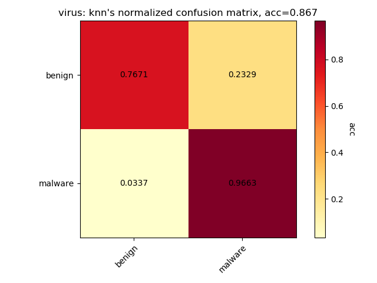

# 实验文档

## 最近更新时间：2019.09.18

## 1.恶意代码检测(detection)

恶意代码检测的基本目的是给定可执行PE文件，判定其是否属于恶意代码，属于二分类问题，基线正确率为50%。

基本的实验方法包括**基于特征提取+SVM/kNN**、**ResNet14**

### 1.1 使用传统机器学习方法

传统机器学习方法的基本思路是：首先利用领域或者专家知识提取PE文件中的特征，基于特征进行分类。
为了顺利的进行实验，模型的拟合不仅需要恶意代码特征样本，还需要良性代码文件作为反例同时
输入到模型中进行训练。本实验中的默认设定是从**Windows**中提取的可执行格式文件：

**exe**,**dll**, **ocx**, **sys**, **com**

同时为了与恶意文件的大小对齐，设定良性文件的大小范围为：

**15~3000 KB**

结果从Windows文件夹下提取到x个良性文件样本

#### 1.1.1 提取特征方法

提取特征的方法参考了 "Transfer Learning for Image-Based Malware Classification",
Bhodia et.al(2019), 使用GitHub上的[PeFile模块](https://github.com/erocarrera/pefile)。
其主要提取的是PE文件的**代码特征**，例如头文件大小SizeOfHeads，代码大小SizeOfCode，
SectionMeanEntropy模块平均熵等，总共54个特征作为分类时每个PE文件的特征向量。

通过观察，这些特征各个维度上的数据差距实质上较大。查看其中一个样本提取到的特征的值：


通过观察可以发现：

- 特征内部的数据的尺度相差极大：例如代码段大小等数据就可能达到$10^{4}$的数量级，但是对于
例如MajorLinkerVersion主链接器版本等特征，其数量级仅仅在个位数上

- 某些特征的对于分类的贡献十分微小：例如第一个特征Machine，通过查看前100个样本的该值与label：


可以发现该值大部分都是相同的332，同时少量不同值为34404的样本的标签并没有与其他值为332的标签有显著
不同，说明Machine特征对于分类的贡献十分微小。同时，Machine这类特征属于枚举类值，在值上样本间并不
会有较大的波动，因此该特征作为特征向量的一部分会造成数据中存在大量的冗余。

- 数据的维度太高，降维前有54维，对于SVM，决策树等方法来说难以拟合

#### 1.1.2 利用提取到的特征进行传统机器学习的分类

利用之前得到的数据可以直接输入到SVM，KNN等分类器中，其中k=1。利用PCA降维至2维得到
可视化结果。如果不对数据直接处理，得到的结果如下：


结果显示：
- kNN的分类正确率高达99%，这说明利用专家知识和领域知识构建的特征工程能够很好地在样本上发挥作用，使得恶意样本
和良性样本分离开，使得同类样本近邻。

- SVM的正确只有50%，由于本实验本身为二分类，因此该结果说明SVM根本不能直接从数据中学习到任何的知识。初步分析
这是因为**各维度之间数值尺度差距过大**导致的。

- 在利用PCA降维时，查看了各特征值所占的比例，结果发现降维至n=2时，有一个特征值的值所占比例超过了99.99%，而占比第二大的特征值比例仅为$3*10^{-8}$。这说明分类几乎都是基于一个维度上的值进行分类的，实质上其他维度几乎没有分类效果，完全是冗余数据

#### 1.1.3 标准化对传统机器学习性能的影响

因此考虑在读取数据时，对各数据维度进行标准化：

``` python
def normalize_data(data):
    mean = np.mean(data, axis=0)

    std = np.std(data, axis=0)
    normalize_func = lambda x: (x - mean) / std
    data = np.apply_along_axis(normalize_func, axis=1, arr=data)

    return np.nan_to_num(data)
```

将标准化以后的数据重新输入到原模型中，其他设定不变，得到的结果如下：


可以发现经过标准化以后降维的使得分布更加直观，kNN的正确率几乎没有变化，但是SVM的正确直线上升，仅比kNN小1个百分点。

**需要注意的是，标准化是基于所有样本上进行的**。因此，标准化所需的均值和标准差都是
基于训练集+测试集的数据进行的。然而在训练阶段使用测试阶段的数据违背了机器学习的基本
原则，因此在以后的传统机器学习实验中，**均不对样本进行标准化**

#### 1.1.4 某个大类的样本缺失时对该类恶意样本进行分类

考虑对于Virus，Trojan,Worm等大类的一个极限0-shot情况：训练样本中不包含这些大类的
样本，但是测试样本中的恶意代码样本均来自这些大类中。这种设定的目的是检验模型能否在没有见
过某种恶意代码的情况下将其识别出来，称“大类缺省实验”。在实验中，分别选择backdoor，email，
net-worm，trojan和virus作为缺省大类，分别使用不包含这些类的样本的其他类别的数据集训练kNN，
SVM等。同时，遵循1.1.3中阐述的原则，没有对特征进行标准化。训练时，同样使用相同数量的良性样本
同时输入到模型中，良性样本来自Windows。从恶意样本中抽样时，大致依然按照每个文件200个样本的规律。

Backdoor：


Email：


Net-Worm：


Trojan：


Virus:


由实验结果可见：
- kNN的正确率依然十分高，平均约97%，这说明恶意代码大类之间在代码特征上存在
相似性，使得能够没有见过某种大类。但是，考虑另外一种可能性，由于只使用了Windows
的良性样本作为正例，可能会因为良性样本的种类过于单一，使得模型只是学会了“分辨是否是
Windows样本”。因此，后续实验中应该考虑使用更多种类的良性样本

- SVM的正确率依旧保持在接近5成左右，说明SVM确实对高维数据和数据间尺度差距过大难以
进行拟合。**因此在后续实验中将不会再展示SVM的效果，只展示kNN的效果**

#### 1.1.5 良性数据集分离的大类缺省

综合1.1.4中提出的可能性，因此考虑将训练时的良性数据集和测试时的良性数据集进行分离。
实验中又从C:/Program Files目录（该目录下大部分都是Windows工具程序或者驱动）下提
取了一定数量的良性样本，将Windows良性样本作为训练时的正例，将新的良性数据作为测试时
的正例，重新进行1.1.3的实验。结果如下（模型只使用了kNN）：

Backdoor：


Email：


Net-Worm：


Trojan：


Virus:


测试结果的混淆矩阵显示，恶意样本的识别几乎没有收到任何影响，正确率保持在96%~97%
左右；但是良性样本的识别正确率发生大幅度下降：从96%下降到75%左右，下滑了接近20%。
这说明不同背景的良性数据集确实存在差异，而且模型不能够很好地在这种差异上泛化。由于
良性样本的性能下降，使得模型整体的


#### 1.1.6 对良性样本数据的思考

如果要进行恶意代码的识别的话，为了适用在多种环境中，势必需要对各种良性样本都要有很好
的泛化。**因此模型学习应该朝“样本是否是恶意样本”的方向进行**：如果样本的特征接近恶意样本，
结果判定为恶意样本；如果样本在一定的间隔下不接近于恶意样本，则判定为良性样本。即模型
应该只识别恶意样本，不识别良性样本，这样的话应该就能对多种不同环境下的良性样本有更好的
泛化。

但是这个目标很难达到，能想到的唯一的办法就是增加良性样本的多样性，将多种环境下的良性样本输入
模型进行训练。但是问题的核心便落在了数据收集上。从这一点上来看，识别恶意代码的工作远比想象中
复杂得多。

#### 1.1.7 良性样本分离的小样本恶意代码识别


