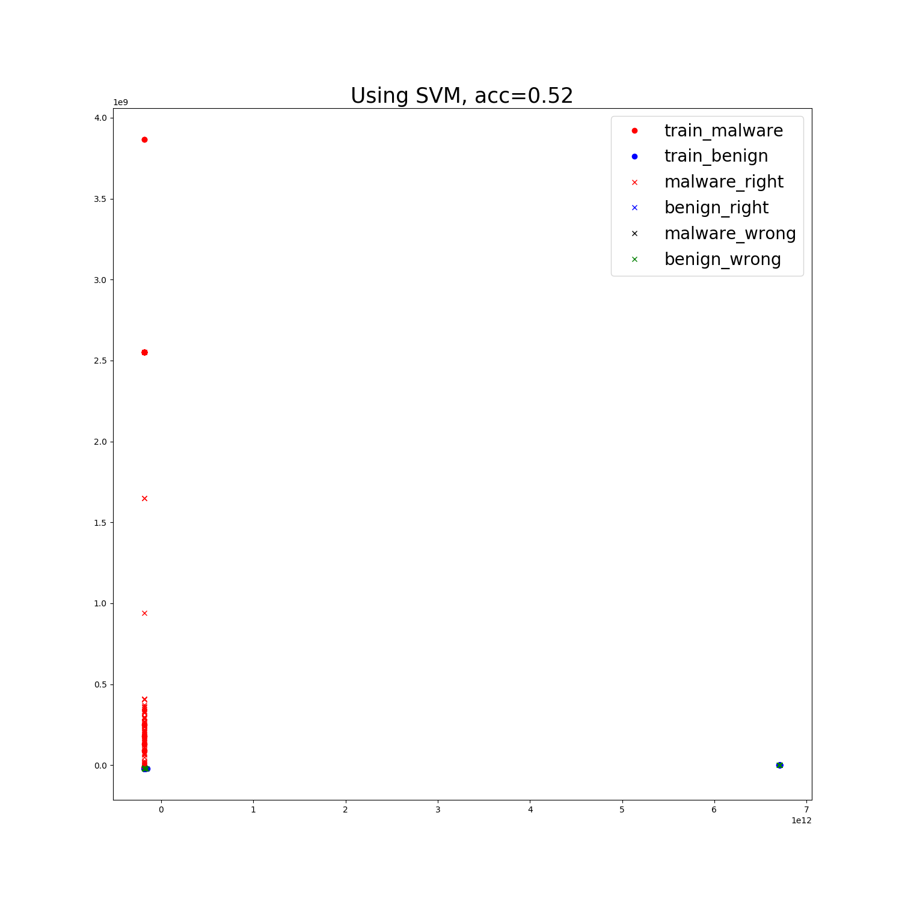
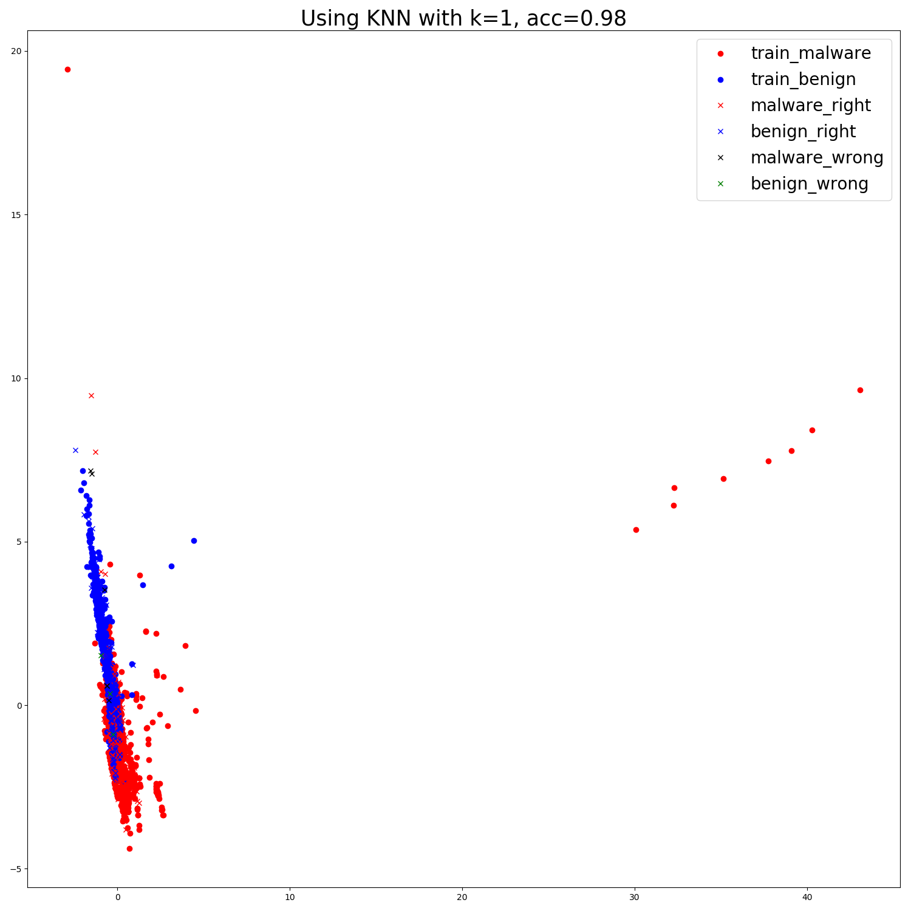
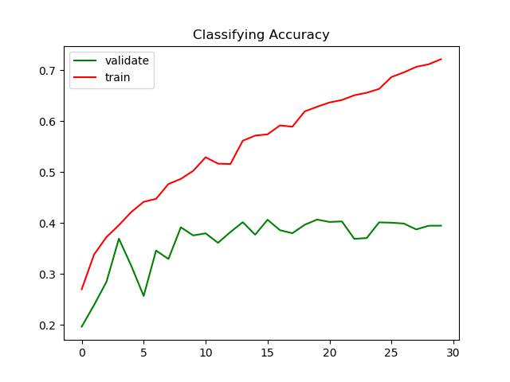

# 实验文档

<script type="text/javascript" src="http://cdn.mathjax.org/mathjax/latest/MathJax.js?config=default"></script>
## 最近更新时间：2019.10.02

[TOC]

## 1.恶意代码检测(detection)

恶意代码检测的基本目的是给定可执行PE文件，判定其是否属于恶意代码，属于二分类问题，基线正确率为50%。

基本的实验方法包括**基于特征提取+SVM/kNN**、**ResNet14**

### 1.1 使用传统机器学习方法

传统机器学习方法的基本思路是：首先利用领域或者专家知识提取PE文件中的特征，基于特征进行分类。
为了顺利的进行实验，模型的拟合不仅需要恶意代码特征样本，还需要良性代码文件作为反例同时
输入到模型中进行训练。本实验中的默认设定是从**Windows**中提取的可执行格式文件：

**exe**,**dll**, **ocx**, **sys**, **com**

同时为了与恶意文件的大小对齐，设定良性文件的大小范围为：

**15~3000 KB**

结果从Windows文件夹下提取到x个良性文件样本

#### 1.1.1 提取特征方法

提取特征的方法参考了 [Transfer Learning for Image-Based Malware Classification",
Bhodia et.al(2019)](Transfer learning for image-based malware classification.pdf), 使用GitHub上的[PeFile模块](https://github.com/erocarrera/pefile)。
其主要提取的是PE文件的**代码特征**，例如头文件大小SizeOfHeads，代码大小SizeOfCode，
SectionMeanEntropy模块平均熵等，总共54个特征作为分类时每个PE文件的特征向量。

通过观察，这些特征各个维度上的数据差距实质上较大。查看其中一个样本提取到的特征的值：


通过观察可以发现：

- 特征内部的数据的尺度相差极大：例如代码段大小等数据就可能达到$10^{4}$的数量级，但是对于
例如MajorLinkerVersion主链接器版本等特征，其数量级仅仅在个位数上

- 某些特征的对于分类的贡献十分微小：例如第一个特征Machine，通过查看前100个样本的该值与label：


可以发现该值大部分都是相同的332，同时少量不同值为34404的样本的标签并没有与其他值为332的标签有显著
不同，说明Machine特征对于分类的贡献十分微小。同时，Machine这类特征属于枚举类值，在值上样本间并不
会有较大的波动，因此该特征作为特征向量的一部分会造成数据中存在大量的冗余。

- 数据的维度太高，降维前有54维，对于SVM，决策树等方法来说难以拟合

#### 1.1.2 利用提取到的特征进行传统机器学习的分类

利用之前得到的数据可以直接输入到SVM，KNN等分类器中，其中k=1。利用PCA降维至2维得到
可视化结果。如果不对数据直接处理，得到的结果如下：


结果显示：
- kNN的分类正确率高达99%，这说明利用专家知识和领域知识构建的特征工程能够很好地在样本上发挥作用，使得恶意样本
和良性样本分离开，使得同类样本近邻。

- SVM的正确只有50%，由于本实验本身为二分类，因此该结果说明SVM根本不能直接从数据中学习到任何的知识。初步分析
这是因为**各维度之间数值尺度差距过大**导致的。

- 在利用PCA降维时，查看了各特征值所占的比例，结果发现降维至n=2时，有一个特征值的值所占比例超过了99.99%，而占比第二大的特征值比例仅为$3*10^{-8}$。这说明分类几乎都是基于一个维度上的值进行分类的，实质上其他维度几乎没有分类效果，完全是冗余数据

#### 1.1.3 标准化对传统机器学习性能的影响

因此考虑在读取数据时，对各数据维度进行标准化：

``` python
def normalize_data(data):
    mean = np.mean(data, axis=0)

    std = np.std(data, axis=0)
    normalize_func = lambda x: (x - mean) / std
    data = np.apply_along_axis(normalize_func, axis=1, arr=data)

    return np.nan_to_num(data)
```

将标准化以后的数据重新输入到原模型中，其他设定不变，得到的结果如下：


可以发现经过标准化以后降维的使得分布更加直观，kNN的正确率几乎没有变化，但是SVM的正确直线上升，仅比kNN小1个百分点。

**需要注意的是，标准化是基于所有样本上进行的**。因此，标准化所需的均值和标准差都是
基于训练集+测试集的数据进行的。然而在训练阶段使用测试阶段的数据违背了机器学习的基本
原则，因此在以后的传统机器学习实验中，**均不对样本进行标准化**

#### 1.1.4 某个大类的样本缺失时对该类恶意样本进行分类

考虑对于Virus，Trojan,Worm等大类的一个极限0-shot情况：训练样本中不包含这些大类的
样本，但是测试样本中的恶意代码样本均来自这些大类中。这种设定的目的是检验模型能否在没有见
过某种恶意代码的情况下将其识别出来，称“大类缺省实验”。在实验中，分别选择backdoor，email，
net-worm，trojan和virus作为缺省大类，分别使用不包含这些类的样本的其他类别的数据集训练kNN，
SVM等。同时，遵循1.1.3中阐述的原则，没有对特征进行标准化。训练时，同样使用相同数量的良性样本
同时输入到模型中，良性样本来自Windows。从恶意样本中抽样时，大致依然按照每个文件200个样本的规律。

Backdoor：


Email：





Net-Worm：


Trojan：



Virus:


由实验结果可见：
- kNN的正确率依然十分高，平均约97%，这说明恶意代码大类之间在代码特征上存在
相似性，使得能够没有见过某种大类。但是，考虑另外一种可能性，由于只使用了Windows
的良性样本作为正例，可能会因为良性样本的种类过于单一，使得模型只是学会了“分辨是否是
Windows样本”。因此，后续实验中应该考虑使用更多种类的良性样本

- SVM的正确率依旧保持在接近5成左右，说明SVM确实对高维数据和数据间尺度差距过大难以
进行拟合。**因此在后续实验中将不会再展示SVM的效果，只展示kNN的效果**

#### 1.1.5 良性数据集分离的大类缺省

综合1.1.4中提出的可能性，因此考虑将训练时的良性数据集和测试时的良性数据集进行分离。
实验中又从C:/Program Files目录（该目录下大部分都是Windows工具程序或者驱动）下提
取了一定数量的良性样本，将Windows良性样本作为训练时的正例，将新的良性数据作为测试时
的正例，重新进行1.1.3的实验。结果如下（模型只使用了kNN）：

Backdoor：


Email：


Net-Worm：


Trojan：


Virus:


测试结果的混淆矩阵显示，恶意样本的识别几乎没有收到任何影响，正确率保持在96%~97%
左右；但是良性样本的识别正确率发生大幅度下降：从96%下降到75%左右，下滑了接近20%。
这说明不同背景的良性数据集确实存在差异，而且模型不能够很好地在这种差异上泛化。由于
良性样本的性能下降，使得模型整体的正确率下降了10%左右。


#### 1.1.6 对良性样本数据的思考

如果要进行恶意代码的识别的话，为了适用在多种环境中，势必需要对各种良性样本都要有很好
的泛化。**因此模型学习应该朝“样本是否是恶意样本”的方向进行**：如果样本的特征接近恶意样本，
结果判定为恶意样本；如果样本在一定的间隔下不接近于恶意样本，则判定为良性样本。即模型
应该只识别恶意样本，不识别良性样本，这样的话应该就能对多种不同环境下的良性样本有更好的
泛化。

但是这个目标很难达到，能想到的唯一的办法就是增加良性样本的多样性，将多种环境下的良性样本输入
模型进行训练。但是问题的核心便落在了数据收集上。从这一点上来看，识别恶意代码的工作远比想象中
复杂得多。

#### 1.1.7 良性样本分离的小样本恶意代码识别

由于1.1.6中提到的良性数据集的多样性，因此后续对应的实验中都采取利用Windows数据集训练，
ProgramFiles中的文件进行测试的设定。同时，为了测定传统机器学习在小样本情境下的效果，
因此**按大类分类，测定大类的小样本性能**。实验一共进行了aworm，backdoor，net-worm，trojan
和virus 5个大类的测定。测试时测定了1-shot和5-shot两种小样本设定。结果如下（k=1）：

aworm：

1-shot:


5-shot:


backdoor：

1-shot:


5-shot:


net-worm：

1-shot:


5-shot:


trojan：

1-shot:


5-shot:


virus：

1-shot:


5-shot:


可以发现：

- 由于样本的采样情况各不相同，导致具有代表性的点和异常点的采样分布不均，因此
5-shot的性能不一定大于1-shot的性能

- 恶意样本的分类正确率明显高于良性样本的分类正确率。这说明恶意样本的分布在该
特征下较为集中，但是良性样本的多样性导致用Windows数据集训练的分类器在小样本
的设定下更加难以泛化到其他良性数据上

- 正确率普遍偏低，二分类的基础正确率有50%，但是大部分的最终正确率都在70%~80%
之间

在大类缺省的基础上，进一步进行了小类缺省的小样本实验，即：训练数据中不包含小类的数据，
如aworm.Win32.AutoRun。其余与上一个实验设定基本相同，结果如下：

aworm.AutoRun：

1-shot:


5-shot:


backdoor.Agent：

1-shot:


5-shot:


backdoor.IRCBot：

1-shot:


5-shot:


backdoor.PcClient：

1-shot:


5-shot:


net-worm.Renos：

1-shot:


5-shot:


trojan.Banker：

1-shot:


5-shot:


trojan.LdPinch：

1-shot:


5-shot:


trojan.OnLineGames：

1-shot:


5-shot:


trojan.Pakes：

1-shot:


5-shot:


trojan.VB：

1-shot:


5-shot:


trojan.Zlob：

1-shot:


5-shot:


由于采样等问题，上述数据表现的正确率等都有较大程度的波动。但是大部分的正确率都位于
70~80%之间。这说明实质上，由于特征提取的性质，导致虽然良性样本与恶意样本分隔了较大
的间隔，但是恶意样本之间实质上并没有很好的分开，即：**基于代码特征的机器学习方法不能**
**很好将恶意代码分类(classification)，但是能够很好进行恶意代码的识别(detection)**

### 1.2 使用深度学习方法

深度学习方法主要是将数据向量化后输入到深度神经网络中得到预测的输出值。本实验中将PE文件
转换为灰度图像的方法参考自 [Natara et.al(2011)](Malware%20Image%20Visualization%20and%20Automatic%20Classification.pdf)
。但是该论文中的将PE文件转换为灰度图像的方法是：对于不同长度PE文件应用不同的固定宽度，
图像的长度是可变的。文件大小与宽度的关系如下：

 大小范围 | 宽度 
-|-
 <10KB | 32
 10-30KB | 64
 30-60KB | 128
 60-100KB | 256
 100-200KB | 384
 200-500KB | 512
 500-100KB | 768
 \>1000KB | 1024

该论文中使用了GIST特征对图像进行小波分解以提取图像的纹理特征，然后将提取的特征输入到欧式
距离的kNN进行分类。参考这种方法，后续有很多实验围绕恶意代码图像进行：

[Gibert et al.(2016)](Convolutional%20Neural%20Networks%20for%20Malware%20Classification.pdf)
使用简单的卷积神经网络进行分类和识别。不仅使用了图像，还使用了微软数据集中提供的反汇编代码
提取Opcode操作码进行分类。

[Kim et al.(2018)](Image-Based%20Malware%20Classification%20Using.pdf)
同样使用的是Conv+FC的经典组合。

[Kalash et al.(2018)](Malware%20Classification%20with%20Deep%20CNN.pdf)
基于VGG-16搭建深度卷积网络+softmax分类器进行分类，同时还改用SVM对GIST特征进行分类
来搭建基线。

[Choi et al.(2017)](Malware%20Detection%20using%20Malware%20Image%20and%20Deep%20Learning.pdf)
使用相似的方式转换图像后，输入到Conv+FC中进行分类。与之前不同的是，论文作者采用固定的256x256
的图像尺寸，该尺寸下的代码大小为固定的64KB。对于大于64KB的文件，之后的部分直接丢弃；对于小于
64KB的图像，将会填充0。文章中作者为了减小显存消耗，还将图片通过下采样将尺寸调整为32x32。

#### 1.2.1 使用ResNet进行恶意代码检测

根据论文[Transfer Learning for Image-Based Malware Classification",
Bhodia et al.(2019)](Transfer learning for image-based malware classification.pdf)
中的描述，他们使用了ResNet34作为恶意代码检测的模型架构。该论文中使用的恶意代码数据集是Malimg
和Malicia两个，而训练使用的良性数据集提取了3304个Windows文件。该论文中的网络是经过ImageNet
数据集预训练的，同时使用了多种技术，如余弦退火cosine annealing，带重启的梯度下降gradient descent
with restart，学习率搜索等。同时使用fast.ai进行实现。该论文中进行了一个十分类似0-shot的实验：
论文中称之为zero day setting，即使用Malimg数据集进行训练，而使用Malicia数据集进行测试。
除此之外，文章对恶意代码识别和恶意代码分类均有涉猎，值得参考。

##### 1.2.1.1 将PE文件转换为恶意代码图像

由于ResNet中要具有分类效果的话需要加入FC层，因此图像只能是固定大小尺寸作为输入。规定图像尺寸为256x256，
为了让不同长度的文件都生成相同尺寸的图像，其具体步骤如下：

1. 仿照论文中的方式，每8bit将二进制文件处理为0-255的一个灰度值，生成长度为L的灰度序列

2. 将序列转换为正方形形状的图像。

    先求正方形图像的边长： $\hat{L} = \lfloor\sqrt{L}\rfloor$

    再取原图像的前$L^2$个灰度值，整理为$\hat{L}\times\hat{L}$的正方形图像

3. $\hat{L} > 256$时，通过scale将图像调整为256x256的图像；$\hat{L} < 256$ 时，通过插值放大
调整为256x256

生成图像时，利用了PIL库中的Image.ANTIALIAS方法进行缩放处理：

```python
        crop_w = int(image.shape[0] ** 0.5)
        image = image[:crop_w ** 2]
        image = image.reshape((crop_w, crop_w))
        image = np.uint8(image)
        if padding and crop_w < WIDTH:
            image = np.pad(image, (WIDTH - crop_w), 'constant', constant_values=(0))
        im = Image.fromarray(image)
        if fuzzy is not None:
            im = im.resize((fuzzy, fuzzy), Image.ANTIALIAS)
        im = im.resize((WIDTH, WIDTH), Image.ANTIALIAS)
```

这种方法能够得到同一尺寸的图像，通过观察可以看到同一个类中的一些图像确实具有相似的纹理和可视特征，
例如:


但是相应的，由于scale会使得图像细节变得模糊，甚至失真，因此即使是某些同类图像也难以直接识别
其是否具有相似的特征。

由于恶意代码图像的缩放和插值处理，同时加上其本身的纹理和特征不具有直观性，因此人类无法直接
通过恶意代码图像直接进行分类。因此，**该识别任务难以进行直观的可视化观测**，同时该任务在性
能上的表现一定会超越人类。

##### 1.2.1.2 训练集分离的ResNet恶意代码检测

遵循之前传统机器学习中的设定：训练集中良性数据集使用Windows数据集，而测试中的良性数据集使用
ProgramFiles的数据集。训练时，按照之前的设定，每一个恶意代码的文件夹都抽取100个样本，共13
个文件夹生成1300个恶意代码的训练样本，同时从Windows中抽取等同数量的良性样本，混合后输入
到ResNet进行训练，训练曲线如下：


显然，由于训练集的分离，使得模型对于良性数据过拟合，而对于恶意代码样本的具有很好的拟合，这
与传统机器学习中的情况相同。同时，模型整体的正确率也显著低于传统机器学习方法。这说明，从
图像上直接提取特征，ResNet的性能很难超越传统机器学习方法。

##### 1.2.1.3 训练集分离的ResNet大类缺省的恶意代码检测

相同的设定，不同的是训练数据中不包含某些大类的数据，然后测试中的恶意代码是来自这些缺少的大类
以此来模拟0-shot的情景：ResNet是否能在没有见过某些数据的情况下对其进行准确分类，是否能提取
到具有良好泛化性的特征。同时，这种测试情景模拟了[Bhodia et.al(2019)](Transfer%20learning%20for%20image-based%20malware%20classification.pdf)
中zero-day的实验设定。

测试结果如下：

backdoor缺省：


trojan缺省：


virus缺省：


与非大类缺省的情况相似，模型在恶意代码上几乎没有出现过拟合现象，分类正确率高达97%左右；
性能瓶颈主要是位于良性数据集上。同时，可以从学习曲线中发现在训练过程中过拟合几乎从训练开始
就出现了，而且随着训练过程进行越来越严重。

##### 1.2.1.4 利用小样本对缺省训练模型进行fine-tuning

由于ResNet此类的深度卷积网络在数据集少时会遭受严重的过拟合，在没有特殊训练方式的支持下
不能直接使用小样本数据进行从头学习。在小样本学习领域的一个普遍的方法是：在其他数据集上进行
预训练，然后利用小样本数据对预训练好的模型进行权重微调fine-tuning。这样使得模型对没见过的
novel class

为了进行该实验，首先在某个大类X缺省的数据集上训练模型，然后利用小样本的X（5-shot）对训练得到
的模型进行微调。选取X=backdoor，trojan和virus三个大类。微调时，为了避免对恶意代码产生
过大的偏置，因此微调的数据集中添加了同等数量的Windows良性样本。

实验结果如下：

backdoor缺省：


trojan缺省：


virus缺省：


可以看到微调并没有对整体正确率有显著的提升：

1. 5-shot用于微调的数据并不能保证具有该类的代表性，因此可能对缺省的类进行分类时其提升效果
并不能被保证

2. 微调时由于缺少原训练集中的数据，因此会**导致对原数据集产生遗忘**

3. 由于没有加入测试集中的分离的良性数据，因此良性数据的分类效果几乎没有提升

因此，如果原训练模型没有很好的结构，或者原模型的训练方式没有很好的定制，或者微调的方式没有
很好的制定，则小样本的微调并不能解决数据适应的问题。

##### 1.2.1.5 尝试利用噪声图像来提高训练集分离时的模型泛化性

在实际应用情景中，我们希望在各种情况下，即遇到不同来源的良性数据集时，模型都能将其与
恶意代码分类开。换句话说，我们希望模型对数据进行“识别其是否是恶意代码，如果不是那就是
良性代码”的任务，即只对恶意代码敏感，而对非恶意代码不敏感。如果模型能够学习到这样的
识别能力，那么只要该代码不含有恶意代码的特征，无论其来自什么数据集或者应用场景中，模型
都能对其进行正确分类。

但是由于模型的训练是基于数据的，除非特殊设计，模型很难对这种能力进行学习。为了达到
这种目的，必须要使良性数据集具有足够大的多样性，同时其不具有恶意代码的特征。首先能够
想到的方式就是**人为生产一定数量的噪声图像输入到模型中作为良性数据集的增补**。

生成噪声的方式主要有均匀噪声，高斯噪声和恒值噪声等。本实验中主要使用高斯噪声，即每个点
的灰度值独立地服从高斯分布，实验中点的采样服从:

$f(x,y) \sim N(128,40)$

正态分布的分布特征：3个标准差内的密度值高达99.9%，以来保证大部分的值位于[0,255]之间，同时大部分的值位于均值附近。

训练时，在训练集中混入良性数据集中Windows文件数量一半数量的噪声图像以帮助训练。同时
训练的基础设定为大类缺省。因此，将在大类缺省的情况下测试噪声加入后的泛化效果。

实验结果显示，噪声并不能加强模型的泛化能力，反而使得模型难以收敛。因此实验只进行了一
部分：


## 2.恶意代码分类

恶意代码分类(malware classification)是指给定某几个类（大类或者小类）的样本，要求训练器能够将同属于这些类的样本进行分类。恶意代码
的大类一般定义为其根类别，如Virus，Trojan，Aworm，DOS等；而小类的定义一般是根据给定的文件的命名方式
而定，一般**文件名取按"."划分以后的前三个字段**。

例如：
Backdoor.Win32.Hupigon.zah 位于backdoor文件夹中，因此其大类为backdoor；其由"."划分的字段的前三
个元素为Backdoor.Win32.Hupigon，因此其小类就对应这个名字。提取其小类名称的代码段如下：

```python
def extract_class_name(name):
    return '.'.join(name.split('.')[:3])
```

恶意代码分类主要分为按大类分类和按小类分类，还有一种分类设定将良性样本视为一种大类或者小类
从而将恶意代码识别和恶意代码分类结合在一起。

### 2.1 传统机器学习的恶意代码分类

与传统机器学习的恶意代码检测几乎相同的是，还是利用PEFile模块提取PE文件的文件特征作为分类
特征。与之前相同的是，因为直接对整个数据集进行标准化会导致训练时对测试数据的依赖，因此实验中
的**所有数据都是没有经过标准化的原始数据**。类似的是，SVM对此类高维数据和数据尺度差距过大的数据难以收敛，导致其几乎没有分类效果，因此实验中只使用k=1的kNN。

#### 2.1.1 传统机器学习的小样本大类分类

为了作为深度学习方法的极限，测试模型在小样本学习设定下将恶意代码大类分类的效果。从数据集中的
5个大类分别抽取了5个样本（5-shot）作为样本，又分别从这5个大类中抽取了不重叠的200个样本作为
测试样本。实验结果如下：


可以看出基于特征的传统机器学习方法的正确率几乎等同于基线，说明该方法虽然对于恶意代码检测的
二分类问题上很有效，但是却不能将各个恶意代码按类别分隔。

#### 2.1.2 传统机器学习的小样本小类分类

于2.1.1中同样的设定，随机从数据集中数量超过400个的小类中抽取200个作为训练样本，100个作为
测试样本，其余的设定与之前几乎一模一样。实验结果如下：


与大类分类在性能上几乎没有改变，正确率依旧停在0.2的基线上。鉴于传统机器学习在恶意代码分类
上的无力，可以考虑**将其作为基线，利用深度学习方法提升恶意代码分类的性能**。


### 2.2 深度学习方法的非小样本恶意代码分类

参考恶意代码检测中的方法，使用ResNet14作为分类的模型，数据的处理方式也与之前的方法相同。
同样是将二进制序列转换为灰度序列转换灰度图后scale的过程。

不同的是样本数据是按照大类或者小类组织的，而不是恶意代码和良性代码的方式组织的。本节的
实验主要有两种设定：

1. 将良性样本作为一种大类加入到数据集中与其他恶意代码的大类混合，分类器将测试样本分类为
良性样本或者恶意代码其中的一个

2. 只抽取恶意代码的小类样本作为训练数据，分类器将测试数据分为这几个类的其中一个，与传统
的分类任务设定几乎相同

#### 2.2.1 良性数据混入的深度学习方法非小样本恶意代码分类

与之前的大类分类相似的，同样提取的是backdoor，trojan，email，aworm与virus5个类的样本，
良性数据来自Windows中。每个类抽取200个样本作为训练数据，100个样本作为测试数据，训练30
个epoch。同样的是，良性数据集的测试数据与训练数据是分离的，即测试数据抽取自ProgramFiles
中。实验结果如下：




正确率只有约35%显得较低。但是仔细观察混淆矩阵可以看到，主要的正确率损失都在良性数据集上，
即之前的**良性数据集难以泛化的问题仍然存在**。除掉良性数据集的结果，其余5个类的分类正确
率可以达到约40%。但其数值仍然偏低。

#### 2.2.2 非小样本学习方法的恶意代码小类分类

与大类分类不同的是：小类分类中不含有良性数据。为了模型收敛，一共训练了100轮才停止，其中
在30轮的时候检测了一次分类正确率，实验结果如下：


训练30轮时的混淆矩阵：


训练100轮时的混淆矩阵：


验证正确率一直在训练的过程中上升，虽然数据有一些过拟合，但是其正确率已经能够达到65%，已经
远远超过了传统机器学习的20%。这说明深度卷积网络对恶意代码图像具有一定的识别能力。

#### 2.2.3 对恶意代码图像识别的一些思考

1. 相比于[Gibert(2016)](Convolutional%20Neural%20Networks%20for%20Malware%20Classification.pdf)
中提到的将反汇编的操作码提取n-gram序列建模方法，将恶意代码转换为灰度图像能够从图像中抽取
固定长度的特征，输入到深度卷积网络中的识别速度比前者**快得多**，而且能够很大程度上减小
内存和显存的消耗

2. 在深度卷积网络的传统应用场景，如图像分类，物体检测，语义分割等中，同一个类别的物体，如
汽车，其在图像中距离拍摄点的距离有近有远，因此其特征相当于在一定程度上被放大或者缩小。因此，
在将PE文件处理为灰度图像时为了将图像处理为固定尺寸时使用的scale操作也将特征一定程度的放大
或者缩小了。得益于卷及网络对这些scale变换具有泛化性，因此scale操作虽然为了得到固定尺寸的
恶意代码图像让图像损失了部分细节，但是由于主要的特征在scale仍然能够保留，因此利用灰度图像
进行分类仍然是可行的

### 2.3 小样本学习

小样本学习是指需要学习的分类或者回归任务中只有少量的的样本（通常为1~20）可供训练。众所周知，
现代的深度网络需要大量的数据以拟合网络内部大量的参数，少量的训练样本必定会造成严重的过拟合。
因此小样本学习从训练模式到网络结构都需要被精细地设计。

一般来说，如果学习任务是n分类问题，则称为n-way；如果每个类别只有k个样本，则称为k-shot。

从[Wang et.al(2019)](Few-shot%20Learning—%20A%20Survey.pdf)的综述和
[Chen,Liu et.al(2019)](A%20Closer%20Look%20At%20Few-Shot%20Classification.pdf)
的Related Work部分都能够了解到小样本学习的基本方法和途径。大部分文献中都将小样本学习划分
为4个子类。

#### 2.3.1 Initialization Based

该方法意图学习模型参数的一个较好的初始值，从而模型能在仅使用少量数据的情况下就能迅速泛化到对应的任务上。

对应的论文有[Finn et.al(2017)](5.ICML-2017%20Model-Agnostic%20Meta-Learning%20for%20Fast%20Adaption%20of%20Deep%20Networks.pdf)等。该文章提出了一种基于梯度下降的元学习（meta-learning）的框架MAML，该框架在任何模型下均可以使用：在每一次训练中采集
一批量的任务$T_i$，模型参数、
$\theta$基于$T_i$中的数据进行一次或者多次梯度下降得到更新后的参数$\theta'$，然后再
在任务$T_i$上根据更新后的参数$\theta'$计算出损失值，利用该损失值更新更新原参数值
$\theta$。更新公式： 

$\theta\gets\theta-\beta\nabla_\theta\sum_{T_i\sim p(T)}L_{T_i}(f_{\theta'})$

其中，$\theta' = \theta - \alpha \nabla_\theta L_{T_i}(\theta)$

该方法通过利用梯度的梯度，即二阶梯度优化模型，将会将参数逐步调整一个平衡点，参数
在改点处对于各个任务都有较高的敏感度(sensitivity)，使得经过少量的梯度下降步骤
便能够让参数快速适应对应的任务。

#### 2.3.2 Distance-Metric based
该方法意图学习一个能够在任务之间泛化的的比较模型，该模型
能够计算两个两个样本的相似度(similarity)。这种模型的模式一般都是先将样本嵌入到嵌入空间（embedding space）中，使得同类的样本能够尽量挨近，而不相同的样本能够很好
地间隔开，然后在该空间中利用距离函数计算样本之间的距离，利用距离得出样本之间的相似
度。由于距离比较方法通常是非参数的(non-parametric),因此距离度量的方法通常具有较好的泛化性，并且收敛的速度更快。不同的学习方法将会采用不同的训练方式。有的算法通过构造属于同类和不
属于同类的样本对(pair)
输入到网络中根据对应的标签获得损失值来训练网络；有的算法通过在不同的任务（Task）上的训练从而
让模型天生拥有在不同的任务上泛化的能力，该模型能够直接在不重新训练的情况下用在没有见过的任务中；
还有的算法将两者结合在一起：模型先在不同的任务上训练以获得在任务间的泛化能力（cross-task），
然后利用任务相关（task-specific）信息将模型迅速泛化到相关的任务上。[Wang et.al(2019)](Few-shot%20Learning—%20A%20Survey.pdf)
在4.2节详细讨论了这三者。

第一个的设定类似于度量学习（metric learning）中的训练策略。度量学习的目的是通过样本让模型学会
如何将相似的样本嵌入和如何度量嵌入样本之间的距离从而让相似的样本尽量接近，而让不相似的样本以较大
的间隔隔开，这种方法常用于图像和文本检索和分类任务中。度量学习过程中，通过使用训练样本$x_i$和
与之相似的$y_i$还有与之不相似的样本$z_i$构造损失函数以进行正例和反例的学习。常用的损失函数有
Triplet Loss，Contrastive loss，Magnet Loss等。以Triplet Loss为例，其形式如下：

$L = \max ({d(x_i,y_i)-d(x_i,z_i)+margin, 0})$

其中，$d(·,·)$ 是距离函数。该损失函数将会以pair的形式将相似的样本距离缩小，将不相似的样本的
距离增大从而达到分隔的任务，使用的几乎都是NCA(Neignborhood Component Analysis)j作为分类
器。具体参见两篇相关的论文: [Movshovitz-Attias et al.(2017)](No%20Fuss%20Distance%20Metric%20Learning%20using%20Proxies.pdf)和[Weinberger et al.](distance-metric-learning-for-large-margin-nearest-neighbor-classification.pdf)

在实验中，使用的最多的设定是第三种设定，**即现在任务间训练以获得较好的泛化能力，然后利用任务具体信息使得模型在具体任务上能够快速适应**。
一般来说，将模型适应到具体任务的方式有两种：一种是利用
该任务的数据进行模型微调(fine-tuning)，另一种不对模型本身进行重新训练，而是直接将任务集数据输入后作为模型的一部分，例如分类用的权重向量，而大部分metric based方法都是将任务中的训练数据输入
模型后得到一组类向量或者类原型(prototype)，然后利用类向量和类原型基于最近邻来进行分类。

学习时，为了能够让嵌入函数和距离函数能够很好地泛化到未见过的任务上，因此采用了与测试时相同的few-shot设定：训练时从任务分布中抽取一个任务$T_i$，该任务中含有训练数据$D_{T_i}^{train}$和
测试数据$D_{T_i}^{test}$，一般来说前者称为sample set，后者称为query set；测试时从任务分布
中抽取一个不在训练时可获得的测试任务$T_i'$，其中也包含训练数据$D_{T_i'}^{train}$和测试数据
$D_{T_i'}^{test}$，前者一般称为support set，后者一般称为test set。这种学习的方式称为
episode training。在元学习设定中，训练
任务中的数据也被称为meta train set，测试数据也被meta test set。

#### 2.3.3 Meta-learning

元学习方法强调learning to learn，目的是让模型能够学会如何泛化到具体的任务中。该学习算法中，
一般将模型分为两个部分：一个称为base learner基学习器，其负责学习如何适应一个具体任务(adapt 
to specific task)；一个称为meta learner元学习器，其负责学习如何指导base learner进行学习
以适应不同的任务。

元学习方法一般是基于算法进行优化，即利用meta learner来改进优化过程。因为meta learner用于
指导base learner进行学习，因此本质上meta learner学习的就是优化的算法。典型的有：
[Ravi et al.(2017)](6.ICLR-2017%20Optimization%20as%20a%20model%20for%20few-shot%20learning.pdf)，[Munkhdala,Yu(2017)](7.ICML-2017%20Meta%20networks.pdf) 和 [Li,Zhou et al.(2017)](Meta-SGD.pdf)。前者从梯度下降的公式中
得到启发，认为LSTM的cell输出公式与梯度下降的更新公式可以进行对应，具体的：

梯度下降： $\theta' = \theta - \alpha \nabla_\theta L(\theta)$
LSTM的cell输出: $c_t = f_t \bigodot c_{t-1} + i_t \bigodot \tilde{c}_{t}$
如果$f_t=1$，$\theta=c_{t-1}$，$i_t=\alpha$，$\tilde{c}_{t}=-\nabla_\theta L(\theta)$，
则可以将LSTM的输出视为参数，LSTM的待选cell作为梯度，**让LSTM学会如何更新参数**。具体地，在每一个
元训练轮回中，base learner负责接收数据，然后将产生损失值和梯度传给meta learner用于产生新的
参数，然后meta learner将新的参数传回给base learner。这样就完成了一次meta learning。该方法
也称为LSTM meta learner。

大部分的meta-learning的设定都与LSTM meta learner相似：为了提高任务间的泛化能力，先利用
meta learner优化模型让其在一个具体的任务上进行学习，然后用另一个不同的任务进行测试产生损失值，
再利用产生的这个meta loss优化meta learner。

MetaNet的思路相似，只是meta learner的任务不再是优化base learner，而是根据memory为base 
learner产生一个快速权重用于学习期快速泛化到新的具体任务中。

虽然meta learning的想法十分诱人，但是其网络结构，学习策略都十分复杂，难以实现。因此在恶意代码
的分类实验中，并**没有尝试使用任何的meta learning方法**，所有的实验或者基线都是基于metric 
learning的。

#### 2.3.4 Hallucination based

这种方法实质上就是从小样本学习的本质难点入手，**利用数据增强方法或者生成式模型产生新的数据以增大
数据计数缓解因为样本过少带来的过拟合问题**。这种方法虽然能从根本上解决小样本学习的困难，但是由于
生成式模型本身训练的困难性，以及难以衡量合成的样本是否在特征分布上与源数据保持一致，因此这种
方法对于性能没有保证，同时实现起来难度也很高。综上，小样本恶意代码分类实验中并没有实验任何该
模型，也没有将该类模型作为基线。

对应的论文有：
[Chen,Fu et al.(2018)](17.ECCV-2018%20Semantic%20Feature%20Augmentation%20in%20Few-shot%20Learning.pdf)   和	[Wang,Girshick et al.(2018)](20.CVPR-2018%20Low-Shot%20Learning%20from%20Imaginary%20Data.pdf)


### 2.4 小样本恶意代码分类

本实验中复现或者实现的模型几乎都是metric based方法


#### 2.4.1 Siamese Network [Koch et al.(2015)](10.ICML-2015%20Siamese%20Neural%20Networks%20for%20One-shot%20Image%20Recognition.pdf)
本文提出了Siamese Network用于手写字符的小样本学习。该论文中利用
孪生的若干堆叠的卷积+非线性变换+池化组合来将图像嵌入，然后将特征矩阵展开为特征向量，
直接将同时输入的两个经过嵌入的样本特征向量求**加权L1距离**输入到FC层中，最后经过sigmoid输
出一个概率值来指示两个样本是否属于同类。


CNN结构中，随着尺寸逐渐减小，通道数逐渐增多，而且卷积核尺寸大小不一，均使用2x2最大池化和ReLU。
这是后来的metric based方法的基础，后续的大部分模型大致延续这种结构。同时，两个作比较的样本输入到网络
的两个孪生（twin）
嵌入模块中，**两个孪生模块共享权重**。

由于论文中的siamese网络只实验了1-shot的设定，没有5-shot，10-shot等更多样本的设定，因此
**不存在induction问题**（将同个类若干样本归纳为一个类向量或者将多个样本的结果归纳为一个类结
果）。所以在实验时，使用均值向量来将5个类样本向量生成为一个类向量，并与查询样本组成pair
输出结果。


#### 2.4.2 Matching Net [Vinyals et al.(2017)](4.NIPS-2016%20Matching%20Networks%20for%20One%20Shot%20Learning.pdf)


这篇论文晚于Siamese Network，具体地提出了一些few-shot的设定。MN先对支持集support set
和查询集query set使用了不同的嵌入，分别称为$g(x)$和$f(x)$，然后使用一个注意力核（Attention 
Kernel）将查询样本的嵌入与支持集样本的嵌入对齐得到注意力系数，利用这个注意力系数得到键值，即支持集样
本标签的加权结果来进行一次预测。

因此，模型本身不具有预测能力，而是作为一个分类器的mapping：$S\to c_s(\hat{x})$。在给定
支持集的时候，模型整体变为$P(\hat{y}|\hat{x},S)$一个关于预测标签的概率分布，即利用了
task-specific信息变成了一个任务相关的模型，使得模型在相关任务上实现了适应（adaption）。
论文中提到，为了提高模型 泛化能力与训练速度，使用非参
数模型(non-parametric)将会大大收益，如基于metric的kNN就是一种非参数方法。MN结合了参数式模
型和非参数模型的优点，样本的嵌入使用的是参数式模型，而样本之间的比较取得相似程度使用的是非参数模型。

因此，对于不同的任务，**只需要给定支持集，就能生成一个适用于该任务的不同的分类器，而且该分类器使用非参数**
方法进行分类，具有更好的泛化性。训练时，可以模仿这种行为，给定一个任务，任务中包含支持集和查询集，支持
集用于生成分类器，查询集用于产生分类损失值并用于优化模型。这种训练方式一定程度上模仿了测试阶段的行为，
使得训练阶段的设定与测试阶段的设定相匹配(make the train strategy match the inference 
setting)。这种训练思路成为了后续metric-based方法均默认遵守的一个准则。

论文中提到的注意力机制中查询值与键相匹配的方式利用的是cosine相似度输入到softmax中。该方式可以视为在
**支持集嵌入和查询集嵌入之间使用cosine距离后输入到softmax分类器中**。后续的模型中大多效仿了这种
方式，只不过采用了不同的距离度量函数，如欧式平方距离，畸变余弦相似度。

模型中的支持集样本和查询集样本嵌入方式采用了不同的两个模块。论文中提到，将支持集样本视为独立的样本
单独嵌入不够恰当，应该将整个支持集整体嵌入，文中称为Full Context Embedding（FCE）。同时，对于不同
的支持集，嵌入的方式应该有所不同，因此不同的支持集对于相同的查询样本应该产生不同的嵌入。具体地：

$f(\hat{x},S)=attLSTM(f'(\hat{x}),g(S), K)$

其中$f'$是一个查询样本的CNN嵌入，$g(S)$是整个支持集的嵌入，attLSTM是带有注意力机制的双向LSTM。

文章中还详细描述了episode training的步骤，简单来说就是在每个episode中，先抽取任务（task），然后在
任务中抽样得到支持集和查询集，在不同的episode就会在不同的训练集上进行训练，从而强迫模型学得更有泛化
能力的模型从而在不同的任务上都能表现的很好。这可以视为一个meta learning策略，让模型不固定在一个任务
上进行学习，而是让模型学会如何适应不同的任务。

这篇论文的主要贡献在于对few-shot模型的一些基本的方法进行了约定。分类方法可以视为一种加权的近邻法。


#### 2.4.3 Prototype Network [Snell et al.(2017)](8.NIPS-2017%20Prototypical%20Networks%20for%20Few-shot%20Learning.pdf)

Prototype原型网络遵循了元学习（meta learning）的一个基础设定：不在一个特定的任务上进行学习，而是在任务间进行学习从而让模型能够学习如何适应不同的任务，因此原型网络也大致遵循Matching Network中的大部分设定，例如在每一个episode中采样得到N个类别，又从N个类别中分别抽取K个样本组成一个N-way K-shot任务的episode-based training；整个模型M作为一个分类器的映射器，提供一个特定的支持集就能生成一个该支持集对应的分类器，不同的支持集生成不同的分类器；分类时使用的是基于距离metric的softmax分类器，分类是在嵌入空间embbeding space上进行的等等。

文中提出，在给定支持集时，良好的嵌入能够在嵌入空间中把支持集样本进行聚类，可以利用这个聚类中心来进行分类任务。作者提出，在使用**基于Bregman距离的距离函数**时，**均值向量是最好的类向量**，同时配合**平方欧式距离**作为距离函数能够达到最好的效果。


模型十分简单：支持集样本和查询集样本都使用相同的嵌入函数嵌入到嵌入空间中，然后计算支持集每个类的类均值向量作为其类的原型向量(prototype)，查询集样本的嵌入利用距离函数分别计算与每个类原型的距离，将距离负值输入到softmax中得到后验概率。算法的前半部分是在计算类原型，后半部分与NCA分类几乎相同。

作者将PrototypeNet与MatchingNet做了比较：后者是加权的近邻分类，每一个样本在进行分类时都会被利用，对分类的贡献（注意力系数）来自cosine距离；前者是先求出一个在Bregman散度下最佳的均值向量作为类的原型，并将原型视为类的聚类进行分类。两者在k=1时几乎相同，只是距离函数的选取不同。还有一点，MatchingNet中将查询集和支持集的样本的嵌入解耦合了，使用了f和g两个不同的嵌入函数；而PrototypeNet没有将两者分开，而是使用了相同的嵌入函数。

作者提出了两个模型的设计选择：

1. 距离函数的选取。作者提出了平方欧式距离和cosine距离两个，同时指出了后者要好于前者，因为前者不属于Bregman散度
2. Episode的组成。作者提出在**训练时和测试时可以不选取相同k和n进行匹配**。例如在训练时选取更多类的分类任务n=10，而测试时使用更小的分类任务n=5。k同理。但是作者提出n不匹配可能可以提升模型表现，但是k不匹配可能反而会导致模型性能下降。

嵌入网络的模型基本遵循Conv4的设定：

每一个Conv由 **Conv2d(kernel_size=3,channel=64, padding=1) + BatchNorm + ReLU + MaxPool(2) **组成，模型由2000轮下降一次学习率的Adam训练，且除了BN外没有使用其他正则化手段。

在模型经过训练以后，在测试阶段不需要进一步的修改或者fine-tuning就可以直接工作，模型一直保持不变。这得益于训练时的meta learning设定带来的泛化性。这样的模型不仅简单，而且能够比其他模型更快地进行inference。


#### 2.4.4 Relation NetWork  [Sung,Yang et al.(2018)](9.CVPR-2018%20Learning%20to%20compare%20Relation%20network%20for%20fewshot%20learning.pdf)

与之前三种网络的结构相似，都是embedding+metric的组合，不同的是利用了CNN+FC的组合作为一个动态可学习的Relation Module来取代原先固定的metric。

相比于PrototypeNet和MatchingNet，RelationNet与SiameseNet更加接近：前两者是将支持集输入到模型中生成一个用于特定任务的分类器，整个支持集的样本都将被用于分类任务中；而后两者更加强调的是利用固定的模型来计算两个单独的样本的相似度，因此只需要提供一个支持集样本而不是整个支持集就能够形成一个分类器，该分类器属于两分类分类器，只负责判定两个样本的相似度。


正因为以上原因，该论文的作者指出RelationNet相比于分类模型更像**回归模型**，因此模型的训练使用的是MSE均方误差损失，而不是分类器常用的负对数损失（交叉熵）。

模型的embedding模块使用的常见的Conv4结构，而relation模块使用的是Conv2+2fc的结构，隐藏层的宽度设为了8，在模型的最后使用sigmoid将fc层输出映射到[0,1]之间。

为了适应k-shot场景，作者提出，**将类内的所有样本嵌入进行相加得到的向量作为类别向量**，同时，在将两个进行比较的向量（query，support）输入到Relation Module中时，作者提出将两者**按通道相连**的结果作为Relation的输入。

文中的训练设定是：Adam优化器，初始学习率为$10^{-3}$，每100000轮减半。可见，metric based方法的meta learning由于任务采样枚举情况过多，导致每一次采样得到的任务几乎都不一样，因此模型收敛需要较长的时间。

论文中为了增强数据，对图像采样了90°整倍数的随机旋转。

但是，由于RelationNet的metric是有参数的(parametric)，相比于非参数模型容易过拟合，在每一个episode任务进行切换时，如果任务之间差距较大，relation模块的学习会产生较大的震荡而难以收敛，而且学习到的relation可能会需要进行fine-tuning才能适应到一个特定的任务上。因此，个人不对RelationNet看好。


#### 2.4.5 Induction Network  [Geng,Li et al.(2019)](Induction%20Net.pdf)

这篇文章来自于阿里巴巴团队，文章主要解决的是文本的小样本分类问题。文章中提出的InductionNet可以视为将多种模型的特点融合在了一起：由Encoder，Induction和Relation部分。其中Encoder类似PrototypeNet等之中的Conv4结构，用于将样本嵌入到Embedding空间中，由于文中是应用在文本分类任务上的，因此Encoder使用的带自注意力机制(self-attention)的双向LSTM：

$a=softmax(W_{a2} tanh(W_{a1}H^T))$   用于计算注意力系数

$e = \sum_{t=1}^Ta_t ·h_t$   使用自注意力得到语义向量。

**Induction Module用于将支持集中一个类中的K个样本归纳成为一个具有代表性的类向量，而不是单纯地求K个向量的平均向量**。其使用的方法仿照了[Sabour et al.(2017)](capsule%20network.pdf)中的动态路由方法(dynamic routing)，根据样本的特征进行迭代的动态地选择路由强度并利用该强度来线性地从K个样本中来生成类向量，其步骤如下：

1. 初始化耦合系数$b_i=0, b_i \in R^{d\times k}$，
2. 将耦合系数输入到softmax中生成加权系数: $d_i = softmax(b_i)$
3. 利用共享的转换矩阵(transformation matrix)将特征转换: $\hat{e_{ij}}=W_s e^s_{ij}$

4. 利用加权系数和转换后的特征得到类向量: $\hat{c_i}=\sum_j d_{ij}·\hat{e_{ij}}$
5. 对类向量进行挤压，使得模长位于[0,1]之间但是向量的方向没有改变: $c_i = \cfrac{\lVert\hat{c_i}\rVert^2}{1+\lVert\hat{c_i}\rVert^2} \cfrac{\hat{c_i}}{\lVert\hat{c_i}\rVert}$
6. 根据路由协议更新耦合系数，使得与生成的类向量有较大点积的向量的权重增大，减小其他向量的权重：$b_{ij} = b_{ij} + \hat{e_{ij}}·c_i$
7. 重复2~6步骤若干次，论文中的实验设定iters=3

以上就是Induction Module的主要步骤。仔细观察可以发现，由于初始化耦合系数的值为0，因此所有向量在第一次迭代时耦合系数产生的权重在k个样本上相同，**即第一次routing时生成的类向量c为均值向量**，同时迭代过程中使用点积的大小来更新耦合系数。可证明，同一个类原型向量，对于不同的类向量，他们之间的平方欧式距离的大小只取决于两者点积和类向量的模长。**如果将类向量标准化使之模长为定值（例如1），则点积等价于平方欧式距离**，因此可以认为**动态路由方法实质上是以均值向量距离为键的注意力机制的变种（见xxxx）**，两者有许多相似的地方。


除此之外，InductionNet中的Relation Module使用了专门用于度量关系的neural tensor layer [Socher et al., 2013]，整个模型使用**MSE均方误差损失**端到端进行训练，优化器没有选择Adam或者动量SGD，而是Adagrad。

论文中提出，使用转换矩阵+动态路由的induction module，能够忽略不相关的特征与噪声，封装具有更广义的信息，而且指出使用类原型的方式而不是样本的逐个比较能够减小因为样本同一语义的不同表达造成的扰动。模型的训练策略与前几个模型大致相同，都是采用**支持集S输入到模型中产生分类器，优化器优化分类器在查询集Q上的损失值**。由于在类别数c=159，k=5时组合数已经到达了80亿左右，因此这样的meta learning能够在不同任务上进行训练减轻过拟合。


#### 2.4.6 Imprinted Weights   [Qi,Brown et al.(2018)](Low-Shot%20Learning%20with%20Imprinted%20Weights.pdf)

这篇论文的基本思路与前几篇也基本一样，且创新点较少。文章的基本想法是：Conv+fc的分类网络中，Conv的输出输入到fc中分类，因此Conv的输出实质上可以视为嵌入后的向量，这也是embedding的基本思想。因此作者认为，可以使用纯Conv的结构，然后将多个类的Conv输出向量按列组合成一个权重矩阵，该矩阵就效仿conv+fc结构中的fc层的权重，因此可以将多个类的样本嵌入后直接“映射”为权重矩阵的列向量。其实质上就是在利用conv结构从输入的支持集中找寻原型向量，再加上文中提到k>1时使用均值向量作为类别的权重列向量，所以实质上该网络就等同于PrototypeNet。

文章中的创新点在于，作者利用了一个Normalization Layer来标准化类向量的模长至1，同时证明了该设定下平方欧氏距离等价于点积:

$\min d(x,p(x)) = \min \lVert x-p(x) \rVert^2 = \max x^Tp(x)$,    因为$\lVert u-v \rVert^2_2=2-2u^Tv, \lVert u\rVert=\lVert v\rVert=1$。

因此，在使用负平方欧式距离输入到softmax中使用交叉熵损失时，等价于将类向量组成的矩阵作为权重矩阵的fc层进行分类，其中fc层的bias=0。令嵌入函数为$f$，则fc层输出$w^T_i f(x)$因为两者都经过了标准化而等价于cosine相似度。作者指出，cosine相似度作为距离函数然后输入到softmax中的不足在于，cosine相似度的最大值为1，最小值为-1，在种类数量$|C|$增长时，经过softmax后的最佳预测仅为:

$P(y_i|x)=\cfrac{e^1}{e^1+(|C|-1)e^{-1}}$，这个值在$|C|=100$时会急剧下降到0.0069，与理想中的one-hot编码差距十分巨大，如下图所示。


因此作者提出需要使用放大因子s来放大cosine距离的值，即：

$p_i(f(x)) = \cfrac{\exp(sw_i^Tf(x))}{\sum_c\exp(sw_c^Tf(x))}$


作者提出，这个放大因子没必要动态选取，可以直接选取一个固定值。可以从下图看到，在s=5左右时，其最大概率值已经接近达到了1(N=5)：


另外，本文中的模型的训练利用的优化器是带0.9动量的RMSProp，并且每4个epoch就将学习率改为原来的0.94。同时，作者提出，本模型在imprinting以后由于和原Conv模型保持相同的参数模型，因此支持fine-tuning来改善正确率。

作者还对为什么取均值向量作为类向量进行了解释：这是建立在同类向量的各个维度之间的值服从单峰分布的假设(unimodal distribution)下的最佳取值；如果值不服从单峰分布，例如多峰分布，则均值其实并不是最佳的取值。


#### 2.4.7 Dynamic Few-shot Learning Without Forgetting   [Gidaris,Komodakis(2018)](Dynamic%20Few-Shot%20Visual%20Learning%20without%20Forgetting.pdf)

这篇文章与上一篇类似，都是将未见过的类的样本输入到模型中生成一个类向量，然后该列向量作为权重矩阵的一个新的列，使得分类时使用cosine相似度再输入到softmax中后可以在添加新类时也新增加一个新类概率，从而让模型“学会了识别新的类”。

这篇文章的不同是，在训练集上进行训练后会根据训练集中的N1个base classes生成N1列类向量，在测试时输入新的类时，模型会作为一个权重生成器，接收输入的新类，为该类生成一个类向量。生成的方式不是单独的将其feed-forward，而是**利用注意力机制从N1个base classes的权重向量中对齐并抽取**，再加上**输入前馈后得到的嵌入的均值向量在一个加权向量加权下的向量值**，即：

$W = \phi_{avg} \odot w'_{avg} + \phi_{att}\odot w'_{att} $

其中，$\phi_{avg}和\phi_{att}$都是d维的可学习的参数，分别用于加权均值向量和注意力向量。其中注意力向量的计算：

$w'_{att} = \cfrac{1}{N'}\sum_{i=1}^{N'}\sum_{b=1}^{K_{base}}Att(\phi_q\bar{z_i'},k_b)·\bar{w_b}$

即利用嵌入后的$K_base$个类向量$\bar{z_i'}$在利用转换矩阵转换后分别与$N'$个权重向量的键$k_b$进行注意力对齐生成注意力系数，然后利用注意力系数加权其权重向量$\bar{w_b}$。其中$k_b$是可学习的键key。


作者解释道，这样做是因为base classes中存许多与新类相似的对象，可以使用注意力机制来提取这些base classes中的知识。由于在新类到来时只需要利用以上步骤将新类的权重列向量加入到权重矩阵中，因此模型的其他类向量仍然存在于权重矩阵中，因此**新类的加入不会失去对原类识别的能力**。

训练时，整个模型也分为两个步骤进行训练：第一个阶段，固定住其他部分的权重，只训练特征提取部分并更新权重向量；第二阶段，固定住特征提取部分，只训练few-shot的权重生成器。训练时，会从训练集中抽取$K_N$个假的新类来模拟测试阶段时的设定。

文中还提出了两个关键思想：

1. cosine距离的优点在于**不会受到数据尺度的影响，只与向量的方向有关**，这很适合从不同module生成的向量进行关系度量，例如模型中的query的嵌入与权重生成器得到的新类权重向量
2. 在向量进行嵌入后就会立刻使用距离度量函数进行距离计算，而嵌入模块的最后一个部分是ReLU非线性变换，会使得向量的数据中只存在非负值，这很大程度上减小了嵌入空间的表达能力。因此文章中提出**将最后一个ReLU移除能够很大地提升分类效果**。


#### 2.4.8 Hybrid Attention Network  [Gao,Han et al.(2019)](Hybrid%20Attention-Based%20Prototypical%20Networks%20for%20Noist%20Few-Shot%20Relation%20Classification.pdf)

这篇文章为metric based方法中两个关键设计决策：**如何从k个类向量归纳出类向量和如何度量向量距离** 提出了一种解决方案。首先，文中提到，从K个类向量提取出类向量时，如果存在噪声样本，则会使得直接取均值向量得到的原型向量出现很大偏差；其次，文章又指出在度量两个向量的距离时，例如使用平方欧式距离时，某些维度上的数据**可能存在过度稀疏或者不具有可分性等问题**而导致平等地看待这些维度会导致距离度量不够充分。因此，文中提出的feature-level attention用于强调更加重要的维度来计算距离，为不同的关系构建不同的距离函数；instance-level attention用于选择支持集中包含更多信息的样本来构建类向量。


在Instance-level attention module中，文中提出了一个重要观点：**对于不同的查询样本query，应该为其生成不同的类向量，而不是为所有查询样本生成相同的类向量**。因此，在instance attention中需要加入query作为输入。文中以类向量和查询样本生成类向量的方式是：将支持集中的每个样本$s_i^j$都与查询集样本$x$在一个fc层$g$转换按元素相乘，经过tanh激活以后相加得到标准化前的注意力系数$e_j$，然后将e输入到softmax中得到注意力系数$\alpha$，具体如下：

$e_j = sum\{\sigma(g(x_i^j)\odot g(x))\}$    ——标准化前的注意力系数

$\alpha_j = \cfrac{\exp{(e_j)}}{\sum_{k=1}^{n_i}\exp(e_k)}$     ——利用softmax生成标准化的注意力系数

$c_i = \sum_{j=1}^{n_i}\alpha_j x^j_i$    ——利用注意力系数生成类向量

该过程对于每一个查询样本，每一个类都需要重复。

在feature-level attention module中，使用的是类似自注意力机制(self-attention mechanism)的方法：将K个支持集样本堆叠成为KxD的矩阵，然后经过若干个卷积层，**每个卷积层都是单列的卷积核$k \in R^{K\times 1}$用于处理单个的特征维度**，在最后会生成一个1xD的向量作为特征的加权向量，**用于在计算欧式平方距离后加权各个对应的维度**。

由于本论文的实验解决的是NLP任务，因此在复现的时候使用了常规的Conv4来代替原论文中的Embedding和Encoder。论文中提到，使用混合注意力的主要目的是为了去噪，因此实验中设计了一系列在有噪先的设定下的实验。


#### 2.4.9 其他论文

1. [Chen,Liu et al.(2019)](A%20Closer%20Look%20At%20Few-Shot%20Classification.pdf) 中对几种有代表性的metric-based方法进行了比较，同时提出了若干改进后的基线，还提出了一些重要结论，如：
   - 减小类内差异(intra-class variation)对浅层模型十分重要，但对深层模型的影响会减弱
   - 最先进的方法之间的性能差异在模型深度加深时会逐渐减小
   - 数据集增强方法，如翻转（flip），随机裁剪(crop)，色彩都懂(color jittering)对正确率的保证十分关键
   - 如果base classes和novel classes之间的差距过大，会降低meta learning的性能，因此**如何使模型适应(adapt) novel classes十分关键**，例如固定住特征提取部分，只fine-tuning softmax分类器
   - meta-learning与meta-testing的设定一致是模型成功的关键
2. [Wang, Yao(2019)](Few-shot%20Learning—%20A%20Survey.pdf) 是一篇百科全书式的小样本学习综述，里面总结了许多关键的小样本学习方法和概念
3. [Keshari, Vatsa(2018)](11.CVPR-2018%20Learning%20Structure%20and%20Strength%20of%20CNN%20Filters%20for%20Small%20Sample%20Size%20Training.pdf)  提出了一种减少参数数量的方法，用于缓解因参数过多而样本过少带来的过拟合问题。论文中提出将卷积网络中的卷积核分为结构(stracture)和强度(strength)两个部分，前者是卷积核的形状和内部的值，后者是卷积的权重。文章中提出使用稀疏字典学习来逐层初始化网络中的卷积核，在小样本学习时，将样本输入后只更新卷积核的强度，而不更新卷积核的结构，从而大大减少了要更新的参数数量，缓解了过拟合。
4. [Zhao et al.(2018)](Dynamic%20Conditional%20Networks(√).pdf)  也提出了一种只对卷积核进行强度训练而对卷积核结构不进行改变的思路。文章中将模型分为了两个部分：Dynamic Convolutional subNet和Conditional subNet。后者接收一个类标签或者ID，然后利用嵌入模型得到一个加权向量W，该向量用于动态地改变各个基础的卷积核的权重，配合经过CNN嵌入后的图像，再一次动态地进行卷积
5. [Wang,Liu et al.(2017)](13.CVPR-2017%20Multi-attention%20Network%20for%20One%20Shot%20Learning.pdf)  提出了一种利用类标签生成多注意力机制的方法来进行小样本学习。作者指出，在小样本学习中，类标签作为信息的一部分一直没有被很好地利用起来。因此这篇文章中利用了类标签嵌入后生成一系列注意力探测器(attention detector)，然后利用注意力探测器作用在CNN嵌入后的图像的编码特征上生成多个注意力映射作用在图像的编码特征上生成对应图像的特征向量。这种方法虽然看似比较有吸引力，但是由于网络的参数过多，而且涉及到NLP和CV的同时处理，因此复杂度很高，不一定适合大部分任务。
6.  注意力机制相应的论文
   - [Fu, Zheng et al.(2018)](Look%20Closer%20to%20See%20Better%20Recurrent%20Attention%20Convolutional%20Neural%20Network%20for%20FineGrained%20Image%20Recognition.pdf)  APN
   - [Wang,Jiang et al.(2017)](Residual%20Attention%20Network%20for%20Image%20Classification.pdf)  Residual Attention
   - [Jaderberg et al.(2016)](Spatial%20Transformer%20Networks.pdf)  Spatial Transformer
   - [Hu,Shen et al.(2019)](Squeeze-and-Excitation%20Networks.pdf) Squeeze and Excitation

### 2.5 相关实验

以下是对以上论文的一些复现或者是对模型改进后的实验

#### 2.5.1 数据处理

参照1.2.1.1节的方法，将恶意代码文件转换为256x256尺寸的恶意代码灰度图像。所有实验中，除特殊说明，几乎**都使用了224x224的随机裁剪和整数倍90°的随机旋转来增强数据**，同时将**所有向量进行标准化**。标准化时使用的**均值和标准差来自于训练集中的数据的计算**，计算方式如下：

$mean = \cfrac{\sum_{i=1}^{|C_{train}|}\sum_{j=1}^{N}\sum_k^n x_{ijk}}{N·|C_{train}|·n}$ 

$std = \sqrt{\sum_{i,j}(\cfrac{\sum_k^n x_{ijk}}{n}-mean)^2}$

在训练集上计算出mean和std后，直接将该标准化作用在所有数据（包括验证集和测试集中）。由于Pytorch需要使用Dataloader加载数据，而且**如果在训练的时候直接而从原数据文件中读取，向量化并处理会导致训练时间大部分都浪费在CPU对数据的处理上**，因此考虑使用**“用空间换时间”**的策略，将所有数据都处理好以后存入一个文件之间，在训练的时候直接一次性将文件读入到内存中，然后去数据时直接按下标访问数据返回即可，即具体定义如下：
```python
class FewShotFileDataset(Dataset):
    # 直接指向support set或者query set路径下
    def __init__(self, base, n, class_num, rd_crop_size=None, rotate=True, squre=True):
        self.Data = np.load(base, allow_pickle=True)
        self.Label = []
        self.CropSize = rd_crop_size
        self.Rotate = rotate
        self.Width = self.Data.shape[2] if squre else None
        for i in range(class_num):
            self.Label += [i]*n
        assert len(self.Label)==len(self.Data), "数据和标签长度不一致!(%d,%d)"%(len(self.Label),len(self.Data))
    def __getitem__(self, index):
        w = self.Width
        crop = self.CropSize
        img = t.FloatTensor(self.Data[index])
        if crop is not None:
            assert self.Width is not None and self.Data.shape[2]==self.Data.shape[3], "crop不能作用在非正方形图像上!"
            bound_width = w-crop
            x_rd,y_rd = rd.randint(0,bound_width),rd.randint(0,bound_width)
            img = img[:, x_rd:x_rd+crop, y_rd:y_rd+crop]
        # 依照论文代码中的实现，为了增加泛化能力，使用随机旋转
        if self.Rotate:
            rotation = rd.choice([0,1,2,3])
            img = t.rot90(img, k=rotation, dims=(1,2))
        label = self.Label[index]

        return img,label

    def __len__(self):
        return len(self.Data)
```

该方法大大加快了训练速度，使得训练时间缩短为原来的1/3左右。

#### 2.5.2 无监督清洗数据

为了对噪声数据进行清洗，使得同一个类的数据有更大的相似度提高分类效果，考虑采用无监督学习方法对训练数据进行聚类，选取同一个类簇内部的数据作为数据集中的一个类的数据。实验中采用的是**DBScan密度聚类**方法对原PE文件中属于同一个子类文件进行聚类，选取其中数量大于N=20的类簇中的任意20个样本作为该子类的训练数据。聚类时PE恶意代码文件的特征向量的提取来自于1.1.1节中的方法，同时**对数据在同一个类中进行类标准化**。同时，为了让类簇内部的点数量大于N=20，在使用DBScan时设定min_samples参数值等于N=20，代码如下：

```python
def DBscan_cluster(datas, base_num, name=None, plot=False, fig_save=None):
    name = name if name is not None else ''
    dbscan = DBSCAN(eps=0.5, min_samples=base_num)
    labels = dbscan.fit_predict(datas)
```

实验中，聚类结果如下：


**如果类别中一个类簇都没有（聚类结果全是噪声），则不会选取该类的样本加入到数据集中**。

聚类的部分代码如下：
```python
def get_data_clusters(base, base_num, cluster_func=DBscan_cluster):
    clusters = {}
    sub_index = 0
    for c in os.listdir(base):
        count = count_class_num(base+c+'/')
        print(count)
        for sub_c,num in count.items():
            print(sub_index,sub_c)
            sub_index += 1
            sub_cluster = {}
            if num < base_num:
                continue
            try:
                c_datas,file_names = filter_by_sub_classname(base+c+'/', sub_c, pca=2, normal=True)
            except:
                continue
            labels = cluster_func(c_datas, base_num,
                                  fig_save='D:/Few-Shot-Project/data/cluster_plot/'+sub_c+'.png',
                                  name=sub_c, plot=True)

            # 去掉噪声只有n-1个类
            label_size = len(set(labels))-1

            if label_size == 0:
                continue

            # 初始化类簇字典
            for i in range(label_size):
                sub_cluster[i] = []

            for n,l in zip(file_names, labels):
                # 过滤噪声
                if l == -1:
                    continue

                # 按类簇将名称放入
                sub_cluster[l].append(base+c+'/'+n)
            clusters[sub_c] = sub_cluster
            print("dict length: %d"%len(clusters))
            del c_datas,file_names
    return clusters```
```

该方法将会将所有有类簇的类及其类簇内部的数据存储在字典中，因此编写对应抽取数据的方法便可以形成清洗后的数据集：

```python
def make_few_shot_data_by_cluster(clusters, dest, fix_width=False, num_per_class=20, base=MALWARE_BASE):
    def extract_class_name(name):
        return '.'.join(name.split('.')[:3])

    rd.seed(time.time()%10000000)
    i = 0

    del_class_name = []
    del_class_index = []
    # 先根据数量限制过滤聚类字典中的类簇
    for class_name,cluster in clusters.items():
        for cluster_index in clusters[class_name].keys():
            if len(clusters[class_name][cluster_index]) < num_per_class:
                print('delete %s with num=%d'%(class_name+str(cluster_index), len(clusters[class_name][cluster_index])))
                del_class_name.append(class_name)
                del_class_index.append(cluster_index)

    for n,c in zip(del_class_name, del_class_index):
        del clusters[n][c]

    for super_c in os.listdir(base):
        classes = set(map(extract_class_name,os.listdir(base+super_c)))
        for class_name,cluster in clusters.items():
            # 如果本个文件夹中没有该类，则跳过
            if  class_name not in classes:
                continue
            # 避免重复创建文件夹
            if os.path.exists(dest+class_name+'/'):
                continue
            i += 1
            os.mkdir(dest+class_name)
            candidate_cluster = rd.choice(list(cluster.keys()))
            candidate_instances = rd.sample(cluster[candidate_cluster], num_per_class)
            # 避免同类名在不正确的文件夹中出现
            try:
                print(candidate_instances)
                for each_inst in candidate_instances:
                    method = 'fix' if fix_width else 'normal'
                    img = convert(each_inst, method=method, padding=False)
                    file_name = each_inst.split('/')[-1]
                    img.save(dest+class_name+'/'+file_name+'.jpg', 'JPEG')
            except OSError:
                print(dest+class_name+'/')
                shutil.rmtree(dest+class_name+'/')
```

经过聚类处理以后生成数据集中，同一个类的恶意代码图像拥有高度相似的图像特征，例如 ：


最终产生了208个类的数据，每个类中含有20个样本。在未加说明时，都是100个类作为训练集，58个类作为验证集，剩余50个类作为测试集。

#### 2.5.3 Conv4嵌入结构

为了使得各个模型的关键部分具有可比性，现规定每个模型都使用相同的嵌入结构，即Conv4结构。Conv4是指4个连续堆叠的卷积网络层，其基本的结构为Conv+BatchNorm+ReLU+Maxpool。大部分论文中的Conv4的通道数都为固定的64，但是由VGG，ResNet等网络结构的启发，大部分的深度卷积网络结构都是使得图像的宽度逐渐变小，但是通道数逐渐增多的结构，如下图所示：


因此，Conv4嵌入结构的通道数统一为1->32->64->128->256，Maxpool的宽度均为2，stride的数量取决于图片宽度，目的是最终让图像变为通道数为256的1x1的图像阵列。因为本实验中图像的输入为剪裁后大小为224x224的图片，因此通过计算可得stride均为2。具体地，代码如下：

```python
        self.layer1 = nn.Sequential(
            nn.Conv2d(1, 32, kernel_size=3, padding=1, stride=2, bias=False),
            nn.BatchNorm2d(32, affine=True),
            nn.ReLU(inplace=True),
            nn.MaxPool2d(2))
        self.layer2 = nn.Sequential(
            nn.Conv2d(32, 64, kernel_size=3, padding=1, stride=2, bias=False),
            nn.BatchNorm2d(64, affine=True),
            nn.ReLU(inplace=True),
            nn.MaxPool2d(2))
        self.layer3 = nn.Sequential(
            nn.Conv2d(64, 128, kernel_size=3, padding=1, stride=2, bias=False),
            nn.BatchNorm2d(128, affine=True),
            nn.ReLU(inplace=True),
            nn.MaxPool2d(2))
        self.layer4 = nn.Sequential(
            nn.Conv2d(128, 256, kernel_size=3, padding=1, stride=2, bias=False),
            nn.BatchNorm2d(256, affine=True),
            nn.ReLU(inplace=True),
            nn.MaxPool2d(2))
        )
```

#### 2.5.4 初始化方式

在RelationNet的开源实现中，作者给出了一种初始化方式，其代码如下：
```python
#每个神经网络层的权重的初始化方法，用于传递给module中所有的子模块的函数参数
def RN_weights_init(m):
    classname = m.__class__.__name__
    #如果是卷积层
    if classname.find('Conv') != -1:
        #计算卷积核的长x宽x数量，得到总共需要初始化的个数
        n = m.kernel_size[0] * m.kernel_size[1] * m.out_channels
        #将权重向量初始化为以0为均值，2/n为标准差 的正态分布
        m.weight.data.normal_(0, math.sqrt(2. / n))
        #如果该层存在偏置项，则将偏置项置为0
        if m.bias is not None:
            m.bias.data.zero_()
    #否则该层为批正则化
    elif classname.find('BatchNorm') != -1:
        #将数据全部置为1
        m.weight.data.fill_(1)
        #偏置项置为0
        m.bias.data.zero_()
    #否则为线性层时
    elif classname.find('Linear') != -1:
        #n为线性层的维度
        n = m.weight.size(1)
        #权重全部初始化为简单正态分布
        m.weight.data.normal_(0, 0.01)
        #偏置项全部置为1
        m.bias.data = torch.ones(m.bias.data.size()).cuda()
```

卷积层的初始化方式类似于torch.nn.init.kaiming_normal中的方法，计算fan-in作为正态分布标准差的一部分；其BN层的初始化方式就是简单的将权重置1，偏置为0；线性层使用简单的固定标准差的正态分布。实验中大部分都没有使用这种初始化方式，而是使用另一种初始化方式：

```python
def net_init(m):
    classname = m.__class__.__name__
    if classname.find("Conv") != -1:
        for name,par in m.named_parameters():
            if name.find('weight') != -1:
                kaiming_normal_(par, nonlinearity="relu")
            elif name.find('bias') != -1:
                constant_(par, 0)

    elif classname.find("Linear") != -1:
        for name,par in m.named_parameters():
            if name.find('weight'):
                try:
                    xavier_normal_(par)
                except ValueError:
                    print(name)
            elif name.find('bias') != -1:
                # constant_(par, 0)
                normal_(par, 0, 0.01)
```

这种方式类似于上一中初始化方式，只是稍微修改了线性层的初始化方式，使用xavier初始化，同时对卷积层使用更加简洁的接口来初始化。

#### 2.5.5 Siamese 网络复现

参照2.4.1节的描述，实现了Siamese网络结构，为了有可比较性，嵌入部分使用的是常规的Conv4结构。不同的是，论文中作者在卷积层后使用了加入了一个长度为4096的全连接层，但是根据模型的实现方式，如果在此处加入4096长度的全连接层，其输入为256通道的2d图像，在图像为最小尺寸1x1的情况下，该层的参数数量也为：1x1x256x4096 = 1048576，即104万个参数，这很有可能导致显存爆炸，同时过大数量的参数数量会导致严重的过拟合。**因此在复现模型时，取消了此处的全连接层，直接将256通道的数据展平后与另一个孪生的样本做加权L1距离后输入到全连接层中**，然后全连接层输出维度为1的输出经过sigmoid得到结果。

但是，由于原生的Siamese网络只考虑了1-shot的情景，因此本实验中测试的5-shot就难以适用。为了适应这种情况，将5个类内的样本嵌入后**求类内样本的均值向量作为比较对象，然后输出样本与该类的相似度**。

本实验使用聚类后的数据集，使用论文中交叉熵损失函数（由于是二元交叉熵，因此使用了torch.nn.BCELoss）和0.001初始学习率的Adam优化器优化，一共训练60000轮，每15000轮将学习率下降到原先的0.1。训练结果如下：


可见，模型的训练过程中震荡较大，而且出现了过拟合，最终的验证正确率停留在70%多一点。

#### 2.5.6 Relation 网络复现

由于本论文中的代码在Github上有开源：[RelationNetwork](https://github.com/floodsung/LearningToCompare_FSL), 因此直接仿照该论文中的实现即可。但是，为了配合Conv4的统一结构，对一些地方进行修改，例如BatchNorm的动量因子，Conv的stride，Adam的初始学习率等。其他大部分遵守原论文中的设定，例如隐藏层的宽度为8等。在复现过程中，尝试过将隐藏层的宽度加大至256,64等，但是效果不甚理想，甚至不如宽度为8。论文中，使用的是MSE均方损失函数，因此实现时其代码由于损失函数的改变而有所不同。

非聚类数据：


使用聚类数据：


由于聚类数据的效果显然不如其他模型，因此没有进行进一步的具体测试。可以发现，RelationNet的性能确实因为之前所述的原因而不太理想。

#### 2.5.7 Prototype 网络复现

按照原论文中的描述进行复现：使用Conv4结构嵌入图像；直接求均值向量作为类向量；使用平方欧氏距离函数；将负距离值输入到softmax中得到概率输出；利用负对数损失函数进行训练；使用Adam优化器，初始学习率为0.001，权重衰竭值为1e-4；学习率每15000轮下降到原来的0.1等等。

实验中对该网络有很多不同的修改，将在下文中提出。但是原生的网络在聚类数据集上的表现十分优秀，其结果如下：


其测试结果如下。以后所有的实验如果不加特殊说明，均为在测试集上进行了12000轮测试得到的平均值：


---

如果使用非聚类的数据集，则结果如下：


可以发现聚类使得同类数据之间具有较高的相关度从而让模型的识别正确率大大提高了约15%。但是与此同时，可以发现**模型的过拟合程度也提高了一些**，这说明聚类数据会加剧模型的过拟合。

为了验证模型是否在嵌入空间中将各个点分离开，使用了**MDS**将验证集中的支持集样本可视化，其结果如下：

不同正确率

。。。。。

非聚类数据：


上图中，同类的点使用了线进行连接来强调同类的支持集数据。

---

聚类数据：


可以发现，经过聚类后的数据的支持集分布有了更加明的间隔，使得类别之间的可分更大，虽然还有部分类和点分离得不是很开，但可以看到大部分类分离的十分彻底，例如下图：


由于ProtoNet是基于平方欧式距离进行分类的，当且仅当在这种设定下才能使用可视化方式查看效果。如果使用的是cosine相似度或者是其他参数方法来度量距离，则不能使用直接的可视化查看分离状况。

为了缓解过拟合现象，尝试了许多不同的方式，如：改为带动量的SGD优化，增大权重衰竭（有论文指出，因为**Adam采用了二阶估计，其并不是纯梯度下降方法，因此权重衰竭并不等价于L2正则化**，因此论文建议不要在Adam中使用权重衰竭），但是过拟合都没有得到很好的缓解。

#### 2.5.8 PrototypeNet 变种1：使用限制大类的数据集

**（本实验中没有使用聚类数据集）**

对于恶意代码，我们能得出一个天然的假设：相同大类（例如均为Trojan）的恶意代码的相似度一定大于不同大类的恶意代码之间的相似度。因此，首先考虑能否在一个大类上重复以上实验来提高正确率。为此，实验中只抽取了Trojan大类中的数据作为训练，验证和测试集，然后在此基础上重复实验。在**没有使用无监督聚类的情况下**，数据集总共215个类，将其分为150个类作为训练集，35个类作为验证集，30个类作为测试集，其结果如下：


结果出人意料：在一个大类内部的训练并没有让模型的性能提升，反而使得模型的过拟合更加严重，正确率下降了约8%，简单推测其原因也是**因为数据类别的限制导致模型的抗噪能力下降了**，在测试集中出现噪声的时候无法对噪声进行合理的处理，从而使得模型的正确率下降。（在使用无监督方法清洗数据之后再限制大类的实验是未来的工作）

#### 2.5.9 PrototypeNet 变种2：限制数据的大小范围

**（本实验中没有使用聚类数据集）**

由于本实验中1.2.1.1的数据处理方式是将不论大小的PE文件先转换成正方形灰度图像，再将正方形灰度图像通过scale转换为256x256的图像，因此原正方形图像尺寸不及256的图像将会被插值放大，而原来图像尺寸大于256x256的图像将会使用下采样方法缩小。由于256x256的灰度图像的大小为64KB，而大部分的恶意代码的PE文件都大于这个值，**因此大部分的恶意代码PE文件都是被压缩处理过的，原图像的信息都有一定的损失**。为了减小这种损失，使得图像尽量保留原图中的信息，因此考虑限制数据集中原PE文件的大小，这样同时地也能限制在数据处理时造成的数据损失。

实验中，限制PE文件的大小为16~1024KB，即只提取16~1024KB的PE文件作为数据集，最后一共产生了361个类的数据，其250个作为训练集，61个作为验证集，50个作为测试集。其他设定几乎相同，实验的结果如下：


同样的出现了以上的问题，正确率下降了约7%：**限制大小会让数据的多样性降低，数据的多样性降低导致模型的去噪能力和泛化能力下降，从而使得模型的过拟合加剧**。因此，根据变种1和变种2的结果来看，只从数据的种类来处理数据并不能有效的提升模型的识别能力。


#### 2.5.10 PrototypeNet 变种3：使用基于均值向量注意力机制生成类别向量

2.5.7中复现的网络在经过可视化时发现了一些异常的现象：


---


---


某些样本在数据集中属于噪声或者是与类内其他样本差异很大时，其嵌入结果会很不理想，导致某些点离其对应类的样本点的类簇十分远，属于明显的异常点(outlier)。如果这些异常点属于支持集，则其可能造成直接求均值时，异常点让均值向量偏向异常方向而脱离了正常点的均值中心。因此，为了校正这种偏差，需要让远离类簇的异常点对类向量的贡献更小。使用基于均值向量的注意力机制可以达到这种目的，其具体计算方式如下：

$\bar{x} = \cfrac{\sum_{i=1}^{k}x_{i}}{k}$		先求均值向量

$\alpha = softmax(-d(x_i,\bar{x}))$		利用各个样本与均值向量的距离的求得注意力系数，离得越近系数越大

$x_c = \sum_i^{k}\alpha_i · x_i$		利用注意力系数加权向量求得类向量

这样求得的类向量会偏向离离均值近的样本，使得类向量远离离均值向量较远的异常点，从而达到缓解噪声点干扰的作用。

具体的实现代码如下：
```python
        def proto_attention(tensors):
            # 利用类内向量的均值向量作为键使用注意力机制生成类向量
            # 类均值向量
            # centers shape: [n,k,d]->[n,d]->[n,k,d]
            support_center = tensors.mean(dim=1).repeat(1, k).reshape(n, k, -1)

            # attention shape: [n,k,d]
            # 类内对每个向量的注意力映射，由负距离输入到softmax生成
            attention_map = t.softmax(((tensors - support_center) ** 2).sum(dim=2).neg(), dim=1)
            # [n,k]->[n,k,d]
            # 将向量的注意力系数重复到每个位置
            attention_map = attention_map.unsqueeze(dim=2).repeat(1, 1, d)
            # support: [n,k,d]->[n,d]
            # 注意力映射后的支持集中心向量
            return t.mul(tensors, attention_map).sum(dim=1).squeeze()
```

其他部分不改变，在**未聚类的数据集中**进行实验，结果如下：


在聚类数据集中的实验结果如下：


在聚类前的数据上，注意力机制生成类向量的方式没有让正确率发生提升，反而让正确率下降了约1.5%。分析可能的原因：**有可能是因为数据集中异常点较少，使得需要校正的点也很少，而使用该方法生成的类向量并没有在普通情境下比均值向量更有代表性（其不是Bregman散度）**，因此使得正确率下降。


#### 2.5.11 PrototypeNet 变种4：使用改进后的基于均值向量的注意力机制生成类向量

2.5.10中提出的方法虽然能够以改进类向量生成方式的方法来减小异常点的影响，但是仔细分析后，该方法存在一个缺陷：softmax函数的特征就是对输入值之间的差异十分敏感，因此该方法十分有可能会让类向量收敛到一个具体的样本上去。以下的实验对此进行了说明：实验中多次使用该方法迭代地生成类向量，其中上一次迭代得到的类向量将会作为下一次迭代的公式中的均值向量，基于该类向量重新校正生成新的类向量。


上图中红色点为异常点，蓝色点为正常点，蓝色叉代表均值点，蓝色三角形代表除去异常点时的均值点，也正是我们希望的类向量点。**可以发现类向量在迭代过程中逐渐向一个点收缩，最后直接收敛在一个点上**。更具体的，参考下图，其描述的是K=5时，其中一个值x相对于其他4个值的倍数变化时（假设其他4个值相同），其softmax值变化的曲线。


可以看到，其值在0~4倍时变化的非常快，这意味着即使有较小的变化都会导致softmax值发生较大的变化；另外，在6倍时，其值趋近饱和于1，这意味着如果有一个样本点距离均值比其他样本点都要小6倍时，样本点就回直接收敛在该点上，如果迭代地使用该方法，则该效应会更加明显。

鉴于以上描述，应该设计一种方法使得既可以使类向量点处在正常点附近远离异常点，还应该让类向量点位于正常点的均值点上，而不是让其收敛到一个样本点上。因此，不仅应该将类向量点从离得较远的点推远，还应该将类向量点从离得较近的点附近推远。综上，设计了以下类向量生成方式：

$\bar{x} = \cfrac{\sum_{i=1}^{k}x_{i}}{k}$		先求均值向量

$d_i = d(x_i,\bar{x}))$		求各样本与均值点的距离

$\bar{d} = \cfrac{\sum_i^kd_i}{k}$ 			求距离的均值

$\hat{d_i} = |d_i-\bar{d}|$			求距离与平均距离的差距值

$\alpha = softmax(-\hat{d})$		将距离差距值的负值输入到softmax中得到注意力系数

$x_c = \sum_i^{k}\alpha_i · x_i$		利用注意力系数加权向量求得类向量

这样的话，不仅离均值向量远的点的权重会被减小，而且离均值点近的点的权重也会被减小，其效果图如下：


可以发现，修正后的注意力机制生成的类向量围绕在目标类向量附近，但是修正前的注意力机制生成的类向量直接收敛到一个点上。这说明修正后的注意力机制生成的点更能在有异常点的环境下找到合适的类向量。

关于修正后的注意力机制，其实验如下。

非聚类的数据集：


聚类后的数据集的实验结果：


虽然在聚类前的数据集上，修正后的注意力机制表现反而不如修正前，但是在聚类后的数据集上表现得远好于修正前，但是其表现仍然没有超过普通的均值向量作为类向量的方式。其原因也同2.5.10中总结的一样：异常点只占数据集中的很小一部分，但是这种类向量生成方式不能保证在正常情况下能够生成有代表性的类向量点。因此就会出现不仅性能没有超越原方法还出现了一定的性能下滑。