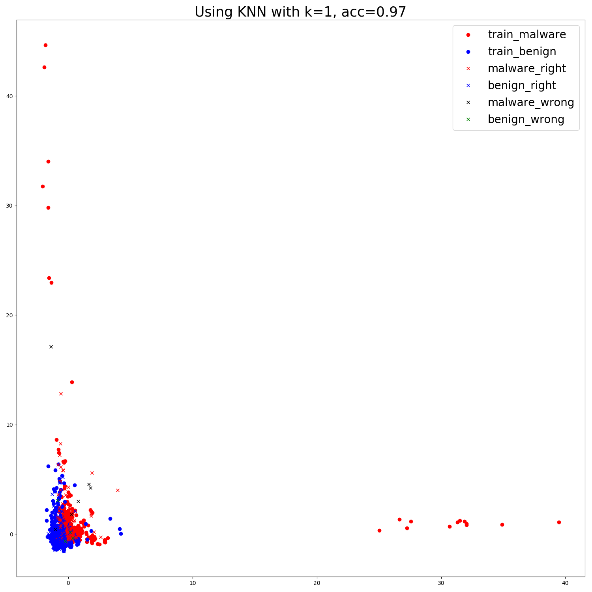
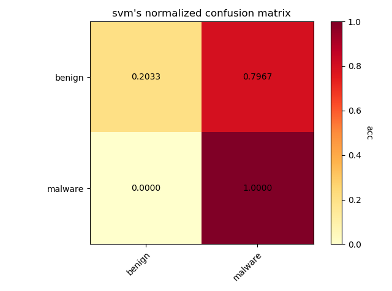

# 实验文档

<script type="text/javascript" src="http://cdn.mathjax.org/mathjax/latest/MathJax.js?config=default"></script>
## 最近更新时间：2019.09.27

[TOC]

## 1.恶意代码检测(detection)

恶意代码检测的基本目的是给定可执行PE文件，判定其是否属于恶意代码，属于二分类问题，基线正确率为50%。

基本的实验方法包括**基于特征提取+SVM/kNN**、**ResNet14**

### 1.1 使用传统机器学习方法

传统机器学习方法的基本思路是：首先利用领域或者专家知识提取PE文件中的特征，基于特征进行分类。
为了顺利的进行实验，模型的拟合不仅需要恶意代码特征样本，还需要良性代码文件作为反例同时
输入到模型中进行训练。本实验中的默认设定是从**Windows**中提取的可执行格式文件：

**exe**,**dll**, **ocx**, **sys**, **com**

同时为了与恶意文件的大小对齐，设定良性文件的大小范围为：

**15~3000 KB**

结果从Windows文件夹下提取到x个良性文件样本

#### 1.1.1 提取特征方法

提取特征的方法参考了 [Transfer Learning for Image-Based Malware Classification",
Bhodia et.al(2019)](Transfer learning for image-based malware classification.pdf), 使用GitHub上的[PeFile模块](https://github.com/erocarrera/pefile)。
其主要提取的是PE文件的**代码特征**，例如头文件大小SizeOfHeads，代码大小SizeOfCode，
SectionMeanEntropy模块平均熵等，总共54个特征作为分类时每个PE文件的特征向量。

通过观察，这些特征各个维度上的数据差距实质上较大。查看其中一个样本提取到的特征的值：


通过观察可以发现：

- 特征内部的数据的尺度相差极大：例如代码段大小等数据就可能达到$10^{4}$的数量级，但是对于
例如MajorLinkerVersion主链接器版本等特征，其数量级仅仅在个位数上

- 某些特征的对于分类的贡献十分微小：例如第一个特征Machine，通过查看前100个样本的该值与label：


可以发现该值大部分都是相同的332，同时少量不同值为34404的样本的标签并没有与其他值为332的标签有显著
不同，说明Machine特征对于分类的贡献十分微小。同时，Machine这类特征属于枚举类值，在值上样本间并不
会有较大的波动，因此该特征作为特征向量的一部分会造成数据中存在大量的冗余。

- 数据的维度太高，降维前有54维，对于SVM，决策树等方法来说难以拟合

#### 1.1.2 利用提取到的特征进行传统机器学习的分类

利用之前得到的数据可以直接输入到SVM，KNN等分类器中，其中k=1。利用PCA降维至2维得到
可视化结果。如果不对数据直接处理，得到的结果如下：


结果显示：
- kNN的分类正确率高达99%，这说明利用专家知识和领域知识构建的特征工程能够很好地在样本上发挥作用，使得恶意样本
和良性样本分离开，使得同类样本近邻。

- SVM的正确只有50%，由于本实验本身为二分类，因此该结果说明SVM根本不能直接从数据中学习到任何的知识。初步分析
这是因为**各维度之间数值尺度差距过大**导致的。

- 在利用PCA降维时，查看了各特征值所占的比例，结果发现降维至n=2时，有一个特征值的值所占比例超过了99.99%，而占比第二大的特征值比例仅为$3*10^{-8}$。这说明分类几乎都是基于一个维度上的值进行分类的，实质上其他维度几乎没有分类效果，完全是冗余数据

#### 1.1.3 标准化对传统机器学习性能的影响

因此考虑在读取数据时，对各数据维度进行标准化：

``` python
def normalize_data(data):
    mean = np.mean(data, axis=0)

    std = np.std(data, axis=0)
    normalize_func = lambda x: (x - mean) / std
    data = np.apply_along_axis(normalize_func, axis=1, arr=data)

    return np.nan_to_num(data)
```

将标准化以后的数据重新输入到原模型中，其他设定不变，得到的结果如下：


可以发现经过标准化以后降维的使得分布更加直观，kNN的正确率几乎没有变化，但是SVM的正确直线上升，仅比kNN小1个百分点。

**需要注意的是，标准化是基于所有样本上进行的**。因此，标准化所需的均值和标准差都是
基于训练集+测试集的数据进行的。然而在训练阶段使用测试阶段的数据违背了机器学习的基本
原则，因此在以后的传统机器学习实验中，**均不对样本进行标准化**

#### 1.1.4 某个大类的样本缺失时对该类恶意样本进行分类

考虑对于Virus，Trojan,Worm等大类的一个极限0-shot情况：训练样本中不包含这些大类的
样本，但是测试样本中的恶意代码样本均来自这些大类中。这种设定的目的是检验模型能否在没有见
过某种恶意代码的情况下将其识别出来，称“大类缺省实验”。在实验中，分别选择backdoor，email，
net-worm，trojan和virus作为缺省大类，分别使用不包含这些类的样本的其他类别的数据集训练kNN，
SVM等。同时，遵循1.1.3中阐述的原则，没有对特征进行标准化。训练时，同样使用相同数量的良性样本
同时输入到模型中，良性样本来自Windows。从恶意样本中抽样时，大致依然按照每个文件200个样本的规律。

Backdoor：


Email：


Net-Worm：



Trojan：


Virus:




由实验结果可见：
- kNN的正确率依然十分高，平均约97%，这说明恶意代码大类之间在代码特征上存在
相似性，使得能够没有见过某种大类。但是，考虑另外一种可能性，由于只使用了Windows
的良性样本作为正例，可能会因为良性样本的种类过于单一，使得模型只是学会了“分辨是否是
Windows样本”。因此，后续实验中应该考虑使用更多种类的良性样本

- SVM的正确率依旧保持在接近5成左右，说明SVM确实对高维数据和数据间尺度差距过大难以
进行拟合。**因此在后续实验中将不会再展示SVM的效果，只展示kNN的效果**

#### 1.1.5 良性数据集分离的大类缺省

综合1.1.4中提出的可能性，因此考虑将训练时的良性数据集和测试时的良性数据集进行分离。
实验中又从C:/Program Files目录（该目录下大部分都是Windows工具程序或者驱动）下提
取了一定数量的良性样本，将Windows良性样本作为训练时的正例，将新的良性数据作为测试时
的正例，重新进行1.1.3的实验。结果如下（模型只使用了kNN）：

Backdoor：


Email：


Net-Worm：


Trojan：


Virus:


测试结果的混淆矩阵显示，恶意样本的识别几乎没有收到任何影响，正确率保持在96%~97%
左右；但是良性样本的识别正确率发生大幅度下降：从96%下降到75%左右，下滑了接近20%。
这说明不同背景的良性数据集确实存在差异，而且模型不能够很好地在这种差异上泛化。由于
良性样本的性能下降，使得模型整体的正确率下降了10%左右。


#### 1.1.6 对良性样本数据的思考

如果要进行恶意代码的识别的话，为了适用在多种环境中，势必需要对各种良性样本都要有很好
的泛化。**因此模型学习应该朝“样本是否是恶意样本”的方向进行**：如果样本的特征接近恶意样本，
结果判定为恶意样本；如果样本在一定的间隔下不接近于恶意样本，则判定为良性样本。即模型
应该只识别恶意样本，不识别良性样本，这样的话应该就能对多种不同环境下的良性样本有更好的
泛化。

但是这个目标很难达到，能想到的唯一的办法就是增加良性样本的多样性，将多种环境下的良性样本输入
模型进行训练。但是问题的核心便落在了数据收集上。从这一点上来看，识别恶意代码的工作远比想象中
复杂得多。

#### 1.1.7 良性样本分离的小样本恶意代码识别

由于1.1.6中提到的良性数据集的多样性，因此后续对应的实验中都采取利用Windows数据集训练，
ProgramFiles中的文件进行测试的设定。同时，为了测定传统机器学习在小样本情境下的效果，
因此**按大类分类，测定大类的小样本性能**。实验一共进行了aworm，backdoor，net-worm，trojan
和virus 5个大类的测定。测试时测定了1-shot和5-shot两种小样本设定。结果如下（k=1）：

aworm：

1-shot:


5-shot:


backdoor：

1-shot:


5-shot:


net-worm：

1-shot:


5-shot:


trojan：

1-shot:


5-shot:


virus：

1-shot:


5-shot:


可以发现：

- 由于样本的采样情况各不相同，导致具有代表性的点和异常点的采样分布不均，因此
5-shot的性能不一定大于1-shot的性能

- 恶意样本的分类正确率明显高于良性样本的分类正确率。这说明恶意样本的分布在该
特征下较为集中，但是良性样本的多样性导致用Windows数据集训练的分类器在小样本
的设定下更加难以泛化到其他良性数据上

- 正确率普遍偏低，二分类的基础正确率有50%，但是大部分的最终正确率都在70%~80%
之间

在大类缺省的基础上，进一步进行了小类缺省的小样本实验，即：训练数据中不包含小类的数据，
如aworm.Win32.AutoRun。其余与上一个实验设定基本相同，结果如下：

aworm.AutoRun：

1-shot:


5-shot:


backdoor.Agent：

1-shot:


5-shot:


backdoor.IRCBot：

1-shot:


5-shot:


backdoor.PcClient：

1-shot:


5-shot:


net-worm.Renos：

1-shot:


5-shot:


trojan.Banker：

1-shot:


5-shot:


trojan.LdPinch：

1-shot:


5-shot:


trojan.OnLineGames：

1-shot:


5-shot:


trojan.Pakes：

1-shot:


5-shot:


trojan.VB：

1-shot:


5-shot:


trojan.Zlob：

1-shot:


5-shot:


由于采样等问题，上述数据表现的正确率等都有较大程度的波动。但是大部分的正确率都位于
70~80%之间。这说明实质上，由于特征提取的性质，导致虽然良性样本与恶意样本分隔了较大
的间隔，但是恶意样本之间实质上并没有很好的分开，即：**基于代码特征的机器学习方法不能**
**很好将恶意代码分类(classification)，但是能够很好进行恶意代码的识别(detection)**

### 1.2 使用深度学习方法

深度学习方法主要是将数据向量化后输入到深度神经网络中得到预测的输出值。本实验中将PE文件
转换为灰度图像的方法参考自 [Natara et.al(2011)](Malware%20Image%20Visualization%20and%20Automatic%20Classification.pdf)
。但是该论文中的将PE文件转换为灰度图像的方法是：对于不同长度PE文件应用不同的固定宽度，
图像的长度是可变的。文件大小与宽度的关系如下：

 大小范围 | 宽度 
-|-
 <10KB | 32
 10-30KB | 64
 30-60KB | 128
 60-100KB | 256
 100-200KB | 384
 200-500KB | 512
 500-100KB | 768
 \>1000KB | 1024

该论文中使用了GIST特征对图像进行小波分解以提取图像的纹理特征，然后将提取的特征输入到欧式
距离的kNN进行分类。参考这种方法，后续有很多实验围绕恶意代码图像进行：

[Gibert(2016)](Convolutional%20Neural%20Networks%20for%20Malware%20Classification.pdf)
使用简单的卷积神经网络进行分类和识别。不仅使用了图像，还使用了微软数据集中提供的反汇编代码
提取Opcode操作码进行分类。

[Kim(2018)](Image-Based%20Malware%20Classification%20Using.pdf)
同样使用的是Conv+FC的经典组合。

[Kalash et.al(2018)](Malware%20Classification%20with%20Deep%20CNN.pdf)
基于VGG-16搭建深度卷积网络+softmax分类器进行分类，同时还改用SVM对GIST特征进行分类
来搭建基线。

[Choi et.al(2017)](Malware%20Detection%20using%20Malware%20Image%20and%20Deep%20Learning.pdf)
使用相似的方式转换图像后，输入到Conv+FC中进行分类。与之前不同的是，论文作者采用固定的256x256
的图像尺寸，该尺寸下的代码大小为固定的64KB。对于大于64KB的文件，之后的部分直接丢弃；对于小于
64KB的图像，将会填充0。文章中作者为了减小显存消耗，还将图片通过下采样将尺寸调整为32x32。

#### 1.2.1 使用ResNet进行恶意代码检测

根据论文[Transfer Learning for Image-Based Malware Classification",
Bhodia et.al(2019)](Transfer learning for image-based malware classification.pdf)
中的描述，他们使用了ResNet34作为恶意代码检测的模型架构。该论文中使用的恶意代码数据集是Malimg
和Malicia两个，而训练使用的良性数据集提取了3304个Windows文件。该论文中的网络是经过ImageNet
数据集预训练的，同时使用了多种技术，如余弦退火cosine annealing，带重启的梯度下降gradient descent
with restart，学习率搜索等。同时使用fast.ai进行实现。该论文中进行了一个十分类似0-shot的实验：
论文中称之为zero day setting，即使用Malimg数据集进行训练，而使用Malicia数据集进行测试。
除此之外，文章对恶意代码识别和恶意代码分类均有涉猎，值得参考。

##### 1.2.1.1 将PE文件转换为恶意代码图像

由于ResNet中要具有分类效果的话需要加入FC层，因此图像只能是固定大小尺寸作为输入。规定图像尺寸为256x256，
为了让不同长度的文件都生成相同尺寸的图像，其具体步骤如下：

1. 仿照论文中的方式，每8bit将二进制文件处理为0-255的一个灰度值，生成长度为L的灰度序列

2. 将序列转换为正方形形状的图像。

    先求正方形图像的边长： $\hat{L} = \lfloor\sqrt{L}\rfloor$

    再取原图像的前$L^2$个灰度值，整理为$\hat{L}\times\hat{L}$的正方形图像

3. $\hat{L} > 256$时，通过scale将图像调整为256x256的图像；$\hat{L} < 256$ 时，通过插值放大
调整为256x256

生成图像时，利用了PIL库中的Image.ANTIALIAS方法进行缩放处理：

```python
        crop_w = int(image.shape[0] ** 0.5)
        image = image[:crop_w ** 2]
        image = image.reshape((crop_w, crop_w))
        image = np.uint8(image)
        if padding and crop_w < WIDTH:
            image = np.pad(image, (WIDTH - crop_w), 'constant', constant_values=(0))
        im = Image.fromarray(image)
        if fuzzy is not None:
            im = im.resize((fuzzy, fuzzy), Image.ANTIALIAS)
        im = im.resize((WIDTH, WIDTH), Image.ANTIALIAS)
```

这种方法能够得到同一尺寸的图像，通过观察可以看到同一个类中的一些图像确实具有相似的纹理和可视特征，
例如:


但是相应的，由于scale会使得图像细节变得模糊，甚至失真，因此即使是某些同类图像也难以直接识别
其是否具有相似的特征。

由于恶意代码图像的缩放和插值处理，同时加上其本身的纹理和特征不具有直观性，因此人类无法直接
通过恶意代码图像直接进行分类。因此，**该识别任务难以进行直观的可视化观测**，同时该任务在性
能上的表现一定会超越人类。

##### 1.2.1.2 训练集分离的ResNet恶意代码检测

遵循之前传统机器学习中的设定：训练集中良性数据集使用Windows数据集，而测试中的良性数据集使用
ProgramFiles的数据集。训练时，按照之前的设定，每一个恶意代码的文件夹都抽取100个样本，共13
个文件夹生成1300个恶意代码的训练样本，同时从Windows中抽取等同数量的良性样本，混合后输入
到ResNet进行训练，训练曲线如下：


显然，由于训练集的分离，使得模型对于良性数据过拟合，而对于恶意代码样本的具有很好的拟合，这
与传统机器学习中的情况相同。同时，模型整体的正确率也显著低于传统机器学习方法。这说明，从
图像上直接提取特征，ResNet的性能很难超越传统机器学习方法。

##### 1.2.1.3 训练集分离的ResNet大类缺省的恶意代码检测

相同的设定，不同的是训练数据中不包含某些大类的数据，然后测试中的恶意代码是来自这些缺少的大类
以此来模拟0-shot的情景：ResNet是否能在没有见过某些数据的情况下对其进行准确分类，是否能提取
到具有良好泛化性的特征。同时，这种测试情景模拟了[Bhodia et.al(2019)](Transfer%20learning%20for%20image-based%20malware%20classification.pdf)
中zero-day的实验设定。

测试结果如下：

backdoor缺省：


trojan缺省：


virus缺省：


与非大类缺省的情况相似，模型在恶意代码上几乎没有出现过拟合现象，分类正确率高达97%左右；
性能瓶颈主要是位于良性数据集上。同时，可以从学习曲线中发现在训练过程中过拟合几乎从训练开始
就出现了，而且随着训练过程进行越来越严重。

##### 1.2.1.4 利用小样本对缺省训练模型进行fine-tuning

由于ResNet此类的深度卷积网络在数据集少时会遭受严重的过拟合，在没有特殊训练方式的支持下
不能直接使用小样本数据进行从头学习。在小样本学习领域的一个普遍的方法是：在其他数据集上进行
预训练，然后利用小样本数据对预训练好的模型进行权重微调fine-tuning。这样使得模型对没见过的
novel class

为了进行该实验，首先在某个大类X缺省的数据集上训练模型，然后利用小样本的X（5-shot）对训练得到
的模型进行微调。选取X=backdoor，trojan和virus三个大类。微调时，为了避免对恶意代码产生
过大的偏置，因此微调的数据集中添加了同等数量的Windows良性样本。

实验结果如下：

backdoor缺省：


trojan缺省：


virus缺省：


可以看到微调并没有对整体正确率有显著的提升：

1. 5-shot用于微调的数据并不能保证具有该类的代表性，因此可能对缺省的类进行分类时其提升效果
并不能被保证

2. 微调时由于缺少原训练集中的数据，因此会**导致对原数据集产生遗忘**

3. 由于没有加入测试集中的分离的良性数据，因此良性数据的分类效果几乎没有提升

因此，如果原训练模型没有很好的结构，或者原模型的训练方式没有很好的定制，或者微调的方式没有
很好的制定，则小样本的微调并不能解决数据适应的问题。

##### 1.2.1.5 尝试利用噪声图像来提高训练集分离时的模型泛化性

在实际应用情景中，我们希望在各种情况下，即遇到不同来源的良性数据集时，模型都能将其与
恶意代码分类开。换句话说，我们希望模型对数据进行“识别其是否是恶意代码，如果不是那就是
良性代码”的任务，即只对恶意代码敏感，而对非恶意代码不敏感。如果模型能够学习到这样的
识别能力，那么只要该代码不含有恶意代码的特征，无论其来自什么数据集或者应用场景中，模型
都能对其进行正确分类。

但是由于模型的训练是基于数据的，除非特殊设计，模型很难对这种能力进行学习。为了达到
这种目的，必须要使良性数据集具有足够大的多样性，同时其不具有恶意代码的特征。首先能够
想到的方式就是**人为生产一定数量的噪声图像输入到模型中作为良性数据集的增补**。

生成噪声的方式主要有均匀噪声，高斯噪声和恒值噪声等。本实验中主要使用高斯噪声，即每个点
的灰度值独立地服从高斯分布，实验中点的采样服从:

$f(x,y) \sim N(128,40)$

正态分布的分布特征：3个标准差内的密度值高达99.9%，以来保证大部分的值位于[0,255]之间，同时大部分的值位于均值附近。

训练时，在训练集中混入良性数据集中Windows文件数量一半数量的噪声图像以帮助训练。同时
训练的基础设定为大类缺省。因此，将在大类缺省的情况下测试噪声加入后的泛化效果。

实验结果显示，噪声并不能加强模型的泛化能力，反而使得模型难以收敛。因此实验只进行了一
部分：


## 2.恶意代码分类

恶意代码分类(malware classification)是指给定某几个类（大类或者小类）的样本，要求训练器能够将同属于这些类的样本进行分类。恶意代码
的大类一般定义为其根类别，如Virus，Trojan，Aworm，DOS等；而小类的定义一般是根据给定的文件的命名方式
而定，一般**文件名取按"."划分以后的前三个字段**。

例如：
Backdoor.Win32.Hupigon.zah 位于backdoor文件夹中，因此其大类为backdoor；其由"."划分的字段的前三
个元素为Backdoor.Win32.Hupigon，因此其小类就对应这个名字。提取其小类名称的代码段如下：

```python
def extract_class_name(name):
    return '.'.join(name.split('.')[:3])
```

恶意代码分类主要分为按大类分类和按小类分类，还有一种分类设定将良性样本视为一种大类或者小类
从而将恶意代码识别和恶意代码分类结合在一起。

### 2.1 传统机器学习的恶意代码分类

与传统机器学习的恶意代码检测几乎相同的是，还是利用PEFile模块提取PE文件的文件特征作为分类
特征。与之前相同的是，因为直接对整个数据集进行标准化会导致训练时对测试数据的依赖，因此实验中
的**所有数据都是没有经过标准化的原始数据**。类似的是，SVM对此类高维数据和数据尺度差距过大的数据难以收敛，导致其几乎没有分类效果，因此实验中只使用k=1的kNN。

#### 2.1.1 传统机器学习的小样本大类分类

为了作为深度学习方法的极限，测试模型在小样本学习设定下将恶意代码大类分类的效果。从数据集中的
5个大类分别抽取了5个样本（5-shot）作为样本，又分别从这5个大类中抽取了不重叠的200个样本作为
测试样本。实验结果如下：


可以看出基于特征的传统机器学习方法的正确率几乎等同于基线，说明该方法虽然对于恶意代码检测的
二分类问题上很有效，但是却不能将各个恶意代码按类别分隔。

#### 2.1.2 传统机器学习的小样本小类分类

于2.1.1中同样的设定，随机从数据集中数量超过400个的小类中抽取200个作为训练样本，100个作为
测试样本，其余的设定与之前几乎一模一样。实验结果如下：


与大类分类在性能上几乎没有改变，正确率依旧停在0.2的基线上。鉴于传统机器学习在恶意代码分类
上的无力，可以考虑**将其作为基线，利用深度学习方法提升恶意代码分类的性能**。


### 2.2 深度学习方法的非小样本恶意代码分类

参考恶意代码检测中的方法，使用ResNet14作为分类的模型，数据的处理方式也与之前的方法相同。
同样是将二进制序列转换为灰度序列转换灰度图后scale的过程。

不同的是样本数据是按照大类或者小类组织的，而不是恶意代码和良性代码的方式组织的。本节的
实验主要有两种设定：

1. 将良性样本作为一种大类加入到数据集中与其他恶意代码的大类混合，分类器将测试样本分类为
良性样本或者恶意代码其中的一个

2. 只抽取恶意代码的小类样本作为训练数据，分类器将测试数据分为这几个类的其中一个，与传统
的分类任务设定几乎相同

#### 2.2.1 良性数据混入的深度学习方法非小样本恶意代码分类

与之前的大类分类相似的，同样提取的是backdoor，trojan，email，aworm与virus5个类的样本，
良性数据来自Windows中。每个类抽取200个样本作为训练数据，100个样本作为测试数据，训练30
个epoch。同样的是，良性数据集的测试数据与训练数据是分离的，即测试数据抽取自ProgramFiles
中。实验结果如下：


正确率只有约35%显得较低。但是仔细观察混淆矩阵可以看到，主要的正确率损失都在良性数据集上，
即之前的**良性数据集难以泛化的问题仍然存在**。除掉良性数据集的结果，其余5个类的分类正确
率可以达到约40%。但其数值仍然偏低。

#### 2.2.2 非小样本学习方法的恶意代码小类分类

与大类分类不同的是：小类分类中不含有良性数据。为了模型收敛，一共训练了100轮才停止，其中
在30轮的时候检测了一次分类正确率，实验结果如下：


训练30轮时的混淆矩阵：


训练100轮时的混淆矩阵：


验证正确率一直在训练的过程中上升，虽然数据有一些过拟合，但是其正确率已经能够达到65%，已经
远远超过了传统机器学习的20%。这说明深度卷积网络对恶意代码图像具有一定的识别能力。

#### 2.2.3 对恶意代码图像识别的一些思考

1. 相比于[Gibert(2016)](Convolutional%20Neural%20Networks%20for%20Malware%20Classification.pdf)
中提到的将反汇编的操作码提取n-gram序列建模方法，将恶意代码转换为灰度图像能够从图像中抽取
固定长度的特征，输入到深度卷积网络中的识别速度比前者**快得多**，而且能够很大程度上减小
内存和显存的消耗

2. 在深度卷积网络的传统应用场景，如图像分类，物体检测，语义分割等中，同一个类别的物体，如
汽车，其在图像中距离拍摄点的距离有近有远，因此其特征相当于在一定程度上被放大或者缩小。因此，
在将PE文件处理为灰度图像时为了将图像处理为固定尺寸时使用的scale操作也将特征一定程度的放大
或者缩小了。得益于卷及网络对这些scale变换具有泛化性，因此scale操作虽然为了得到固定尺寸的
恶意代码图像让图像损失了部分细节，但是由于主要的特征在scale仍然能够保留，因此利用灰度图像
进行分类仍然是可行的

### 2.3 小样本学习

小样本学习是指需要学习的分类或者回归任务中只有少量的的样本（通常为1~20）可供训练。众所周知，
现代的深度网络需要大量的数据以拟合网络内部大量的参数，少量的训练样本必定会造成严重的过拟合。
因此小样本学习从训练模式到网络结构都需要被精细地设计。

一般来说，如果学习任务是n分类问题，则称为n-way；如果每个类别只有k个样本，则称为k-shot。

从[Wang et.al(2019)](Few-shot%20Learning—%20A%20Survey.pdf)的综述和
[Chen,Liu et.al(2019)](A%20Closer%20Look%20At%20Few-Shot%20Classification.pdf)
的Related Work部分都能够了解到小样本学习的基本方法和途径。大部分文献中都将小样本学习划分
为4个子类。

#### 2.3.1 Initialization Based

该方法意图学习模型参数的一个较好的初始值，从而模型能在仅使用少量数据的情况下就能迅速泛化到对应的任务上。

对应的论文有[Finn et.al(2017)](5.ICML-2017%20Model-Agnostic%20Meta-Learning%20for%20Fast%20Adaption%20of%20Deep%20Networks.pdf)等。该文章提出了一种基于梯度下降的元学习（meta-learning）的框架MAML，该框架在任何模型下均可以使用：在每一次训练中采集
一批量的任务$T_i$，模型参数、
$\theta$基于$T_i$中的数据进行一次或者多次梯度下降得到更新后的参数$\theta'$，然后再
在任务$T_i$上根据更新后的参数$\theta'$计算出损失值，利用该损失值更新更新原参数值
$\theta$。更新公式： 

$\theta\gets\theta-\beta\nabla_\theta\sum_{T_i\sim p(T)}L_{T_i}(f_{\theta'})$

其中，$\theta' = \theta - \alpha \nabla_\theta L_{T_i}(\theta)$

该方法通过利用梯度的梯度，即二阶梯度优化模型，将会将参数逐步调整一个平衡点，参数
在改点处对于各个任务都有较高的敏感度(sensitivity)，使得经过少量的梯度下降步骤
便能够让参数快速适应对应的任务。

#### 2.3.2 Distance-Metric based
该方法意图学习一个能够在任务之间泛化的的比较模型，该模型
能够计算两个两个样本的相似度(similarity)。这种模型的模式一般都是先将样本嵌入到嵌入空间（embedding space）中，使得同类的样本能够尽量挨近，而不相同的样本能够很好
地间隔开，然后在该空间中利用距离函数计算样本之间的距离，利用距离得出样本之间的相似
度。由于距离比较方法通常是非参数的(non-parametric),因此距离度量的方法通常具有较好的泛化性，并且收敛的速度更快。不同的学习方法将会采用不同的训练方式。有的算法通过构造属于同类和不
属于同类的样本对(pair)
输入到网络中根据对应的标签获得损失值来训练网络；有的算法通过在不同的任务（Task）上的训练从而
让模型天生拥有在不同的任务上泛化的能力，该模型能够直接在不重新训练的情况下用在没有见过的任务中；
还有的算法将两者结合在一起：模型先在不同的任务上训练以获得在任务间的泛化能力（cross-task），
然后利用任务相关（task-specific）信息将模型迅速泛化到相关的任务上。[Wang et.al(2019)](Few-shot%20Learning—%20A%20Survey.pdf)
在4.2节详细讨论了这三者。

第一个的设定类似于度量学习（metric learning）中的训练策略。度量学习的目的是通过样本让模型学会
如何将相似的样本嵌入和如何度量嵌入样本之间的距离从而让相似的样本尽量接近，而让不相似的样本以较大
的间隔隔开，这种方法常用于图像和文本检索和分类任务中。度量学习过程中，通过使用训练样本$x_i$和
与之相似的$y_i$还有与之不相似的样本$z_i$构造损失函数以进行正例和反例的学习。常用的损失函数有
Triplet Loss，Contrastive loss，Magnet Loss等。以Triplet Loss为例，其形式如下：

$L = \max ({d(x_i,y_i)-d(x_i,z_i)+margin, 0})$

其中，$d(·,·)$ 是距离函数。该损失函数将会以pair的形式将相似的样本距离缩小，将不相似的样本的
距离增大从而达到分隔的任务，使用的几乎都是NCA(Neignborhood Component Analysis)j作为分类
器。具体参见两篇相关的论文: [Movshovitz-Attias et al.(2017)](No%20Fuss%20Distance%20Metric%20Learning%20using%20Proxies.pdf)和[Weinberger et al.](distance-metric-learning-for-large-margin-nearest-neighbor-classification.pdf)

在实验中，使用的最多的设定是第三种设定，**即现在任务间训练以获得较好的泛化能力，然后利用任务具体信息使得模型在具体任务上能够快速适应**。
一般来说，将模型适应到具体任务的方式有两种：一种是利用
该任务的数据进行模型微调(fine-tuning)，另一种不对模型本身进行重新训练，而是直接将任务集数据输入后作为模型的一部分，例如分类用的权重向量，而大部分metric based方法都是将任务中的训练数据输入
模型后得到一组类向量或者类原型(prototype)，然后利用类向量和类原型基于最近邻来进行分类。

学习时，为了能够让嵌入函数和距离函数能够很好地泛化到未见过的任务上，因此采用了与测试时相同的few-shot设定：训练时从任务分布中抽取一个任务$T_i$，该任务中含有训练数据$D_{T_i}^{train}$和
测试数据$D_{T_i}^{test}$，一般来说前者称为sample set，后者称为query set；测试时从任务分布
中抽取一个不在训练时可获得的测试任务$T_i'$，其中也包含训练数据$D_{T_i'}^{train}$和测试数据
$D_{T_i'}^{test}$，前者一般称为support set，后者一般称为test set。这种学习的方式称为
episode training。在元学习设定中，训练
任务中的数据也被称为meta train set，测试数据也被meta test set。

#### 2.3.3 Meta-learning

元学习方法强调learning to learn，目的是让模型能够学会如何泛化到具体的任务中。该学习算法中，
一般将模型分为两个部分：一个称为base learner基学习器，其负责学习如何适应一个具体任务(adapt 
to specific task)；一个称为meta learner元学习器，其负责学习如何指导base learner进行学习
以适应不同的任务。

元学习方法一般是基于算法进行优化，即利用meta learner来改进优化过程。因为meta learner用于
指导base learner进行学习，因此本质上meta learner学习的就是优化的算法。典型的有：
[Ravi et al.(2017)](6.ICLR-2017%20Optimization%20as%20a%20model%20for%20few-shot%20learning.pdf)
和[Munkhdala,Yu(2017)](7.ICML-2017%20Meta%20networks.pdf)。前者从梯度下降的公式中
得到启发，认为LSTM的cell输出公式与梯度下降的更新公式可以进行对应，具体的：

梯度下降： $\theta' = \theta - \alpha \nabla_\theta L(\theta)$
LSTM的cell输出: $c_t = f_t \bigodot c_{t-1} + i_t \bigodot \tilde{c}_{t}$
如果$f_t=1$，$\theta=c_{t-1}$，$i_t=\alpha$，$\tilde{c}_{t}=-\nabla_\theta L(\theta)$，
则可以将LSTM的输出视为参数，LSTM的待选cell作为梯度，让LSTM学会如何更新参数。具体地，在每一个
元训练轮回中，base learner负责接收数据，然后将产生损失值和梯度传给meta learner用于产生新的
参数，然后meta learner将新的参数传回给base learner。这样就完成了一次meta learning。该方法
也称为LSTM meta learner。

大部分的meta-learning的设定都与LSTM meta learner相似：为了提高任务间的泛化能力，先利用
meta learner优化模型让其在一个具体的任务上进行学习，然后用另一个不同的任务进行测试产生损失值，
再利用产生的这个meta loss优化meta learner。

MetaNet的思路相似，只是meta learner的任务不再是优化base learner，而是根据memory为base 
learner产生一个快速权重用于学习期快速泛化到新的具体任务中。

虽然meta learning的想法十分诱人，但是其网络结构，学习策略都十分复杂，难以实现。因此在恶意代码
的分类实验中，并**没有尝试使用任何的meta learning方法**，所有的实验或者基线都是基于metric 
learning的。

#### 2.3.4 Hallucination based

这种方法实质上就是从小样本学习的本质难点入手，利用数据增强方法或者生成式模型产生新的数据以增大
数据计数缓解因为样本过少带来的过拟合问题。这种方法虽然能从根本上解决小样本学习的困难，但是由于
生成式模型本身训练的困难性，以及难以衡量合成的样本是否在特征分布上与源数据保持一致，因此这种
方法对于性能没有保证，同时实现起来难度也很高。综上，小样本恶意代码分类实验中并没有实验任何该
模型，也没有将该类模型作为基线。

对应的论文有：
[Chen,Fu et al.(2018)](17.ECCV-2018%20Semantic%20Feature%20Augmentation%20in%20Few-shot%20Learning.pdf)
和[Wang,Girshick et al.(2018)](20.CVPR-2018%20Low-Shot%20Learning%20from%20Imaginary%20Data.pdf)


### 2.4 小样本恶意代码分类

本实验中复现或者实现的模型几乎都是metric based方法

#### 2.4.1 Siamese Network
[Koch et al.(2015)](10.ICML-2015%20Siamese%20Neural%20Networks%20for%20One-shot%20Image%20Recognition.pdf)提出了Siamese Network用于手写字符的小样本学习。该论文中利用
孪生的若干堆叠的卷积+非线性变换+池化组合来将图像嵌入，然后将特征矩阵展开为特征向量，
直接将同时输入的两个经过嵌入的样本特征向量求**加权L1距离**输入到FC层中，最后经过sigmoid输
出一个概率值来指示两个样本是否属于同类。


CNN结构中，随着尺寸逐渐减小，通道数逐渐增多，而且卷积核尺寸大小不一，均使用2x2最大池化和ReLU。
这是后来的metric based方法的基础，后续的大部分模型大致延续这种结构。同时，两个作比较的样本输入到网络的两个孪生（twin）嵌入模块中，**两个孪生模块共享权重**。

由于论文中的siamese网络只实验了1-shot的设定，没有5-shot，10-shot等更多样本的设定，因此
不存在induction问题（将同个类若干样本归纳为一个类向量或者将多个样本的结果归纳为一个类结
果）。所以在实验时，使用均值向量来将5个类样本向量生成为一个类向量，并与查询样本组成pair
输出结果。

#### 2.4.2 Matching Net

这篇论文晚于Siamese Network，具体地提出了一些few-shot的设定。MN先对支持集support set
和查询集query set使用了不同的嵌入，分别称为$g(x)$和$f(x)$，然后使用一个注意力核利用查询
（Attention Kernel）

的基础理念类似于迁移学习（transfer learning）和元学习（meta learning）


